# V24 Plot Gallery

## Executive Summary
This gallery renders non-final diagnostic and legacy-replay PDFs as PNG previews. No entry here is automatically manuscript-ready.

- Generated entries: 84
- Generated at: 2026-06-08T16:03:13.119225+00:00

## controlled migration ladder

### pos_vary_ues.pdf

- Status: `legacy_network_size_medium_replayed_unverified_match`
- Manuscript ready: `False`
- Source PDF: [outputs/migration_ladder/legacy_staged_compatible/medium/pos_vary_ues.pdf](../migration_ladder/legacy_staged_compatible/medium/pos_vary_ues.pdf)
- Warning: Legacy-compatible network-size medium replay completed under canonical outputs; match is unverified and legacy caveats remain.

- Preview metadata: [previews/9e6045a6dec8__outputs__migration_ladder__legacy_staged_compatible__medium__pos_vary_ues.json](previews/9e6045a6dec8__outputs__migration_ladder__legacy_staged_compatible__medium__pos_vary_ues.json)
- Raw data:
  - [outputs/migration_ladder/legacy_staged_compatible/medium/migration_arrays.npz](../migration_ladder/legacy_staged_compatible/medium/migration_arrays.npz)
  - [outputs/migration_ladder/legacy_staged_compatible/medium/migration_raw.csv](../migration_ladder/legacy_staged_compatible/medium/migration_raw.csv)
  - [outputs/migration_ladder/legacy_staged_compatible/medium/migration_summary.csv](../migration_ladder/legacy_staged_compatible/medium/migration_summary.csv)
- Nearby metadata:
  - [outputs/migration_ladder/legacy_staged_compatible/medium/migration_step_metadata.json](../migration_ladder/legacy_staged_compatible/medium/migration_step_metadata.json)

### sync_vary_ues.pdf

- Status: `legacy_network_size_medium_replayed_unverified_match`
- Manuscript ready: `False`
- Source PDF: [outputs/migration_ladder/legacy_staged_compatible/medium/sync_vary_ues.pdf](../migration_ladder/legacy_staged_compatible/medium/sync_vary_ues.pdf)
- Warning: Legacy-compatible network-size medium replay completed under canonical outputs; match is unverified and legacy caveats remain.

- Preview metadata: [previews/05e1c1073107__outputs__migration_ladder__legacy_staged_compatible__medium__sync_vary_ues.json](previews/05e1c1073107__outputs__migration_ladder__legacy_staged_compatible__medium__sync_vary_ues.json)
- Raw data:
  - [outputs/migration_ladder/legacy_staged_compatible/medium/migration_arrays.npz](../migration_ladder/legacy_staged_compatible/medium/migration_arrays.npz)
  - [outputs/migration_ladder/legacy_staged_compatible/medium/migration_raw.csv](../migration_ladder/legacy_staged_compatible/medium/migration_raw.csv)
  - [outputs/migration_ladder/legacy_staged_compatible/medium/migration_summary.csv](../migration_ladder/legacy_staged_compatible/medium/migration_summary.csv)
- Nearby metadata:
  - [outputs/migration_ladder/legacy_staged_compatible/medium/migration_step_metadata.json](../migration_ladder/legacy_staged_compatible/medium/migration_step_metadata.json)

### pos_vary_ues.pdf

- Status: `legacy_network_size_medium_replayed_unverified_match`
- Manuscript ready: `False`
- Source PDF: [outputs/migration_ladder/legacy_staged_compatible/tiny/pos_vary_ues.pdf](../migration_ladder/legacy_staged_compatible/tiny/pos_vary_ues.pdf)
- Warning: Legacy-compatible network-size medium replay completed under canonical outputs; match is unverified and legacy caveats remain.

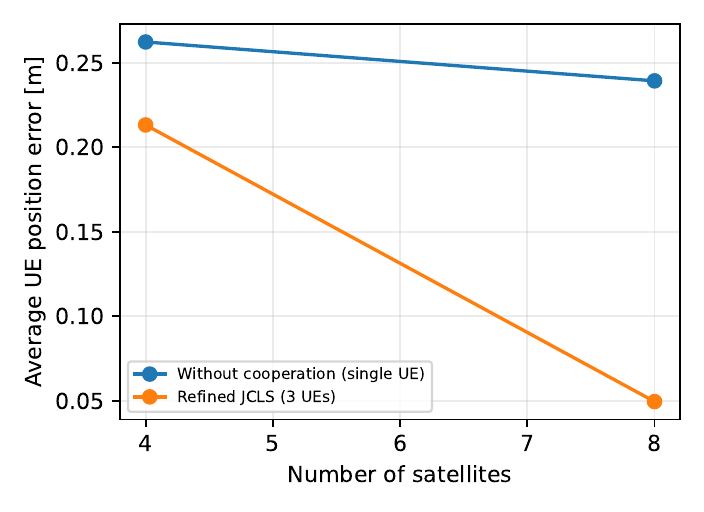
- Preview metadata: [previews/f01df346aead__outputs__migration_ladder__legacy_staged_compatible__tiny__pos_vary_ues.json](previews/f01df346aead__outputs__migration_ladder__legacy_staged_compatible__tiny__pos_vary_ues.json)
- Raw data:
  - [outputs/migration_ladder/legacy_staged_compatible/tiny/migration_arrays.npz](../migration_ladder/legacy_staged_compatible/tiny/migration_arrays.npz)
  - [outputs/migration_ladder/legacy_staged_compatible/tiny/migration_raw.csv](../migration_ladder/legacy_staged_compatible/tiny/migration_raw.csv)
  - [outputs/migration_ladder/legacy_staged_compatible/tiny/migration_summary.csv](../migration_ladder/legacy_staged_compatible/tiny/migration_summary.csv)
- Nearby metadata:
  - [outputs/migration_ladder/legacy_staged_compatible/tiny/migration_step_metadata.json](../migration_ladder/legacy_staged_compatible/tiny/migration_step_metadata.json)

### sync_vary_ues.pdf

- Status: `legacy_network_size_medium_replayed_unverified_match`
- Manuscript ready: `False`
- Source PDF: [outputs/migration_ladder/legacy_staged_compatible/tiny/sync_vary_ues.pdf](../migration_ladder/legacy_staged_compatible/tiny/sync_vary_ues.pdf)
- Warning: Legacy-compatible network-size medium replay completed under canonical outputs; match is unverified and legacy caveats remain.

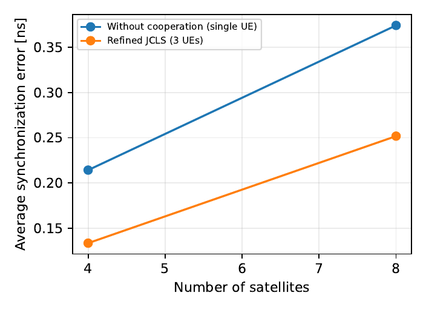
- Preview metadata: [previews/4e5734f83ba5__outputs__migration_ladder__legacy_staged_compatible__tiny__sync_vary_ues.json](previews/4e5734f83ba5__outputs__migration_ladder__legacy_staged_compatible__tiny__sync_vary_ues.json)
- Raw data:
  - [outputs/migration_ladder/legacy_staged_compatible/tiny/migration_arrays.npz](../migration_ladder/legacy_staged_compatible/tiny/migration_arrays.npz)
  - [outputs/migration_ladder/legacy_staged_compatible/tiny/migration_raw.csv](../migration_ladder/legacy_staged_compatible/tiny/migration_raw.csv)
  - [outputs/migration_ladder/legacy_staged_compatible/tiny/migration_summary.csv](../migration_ladder/legacy_staged_compatible/tiny/migration_summary.csv)
- Nearby metadata:
  - [outputs/migration_ladder/legacy_staged_compatible/tiny/migration_step_metadata.json](../migration_ladder/legacy_staged_compatible/tiny/migration_step_metadata.json)

### pos_vary_ues.pdf

- Status: `legacy_network_size_medium_replayed_unverified_match`
- Manuscript ready: `False`
- Source PDF: [outputs/migration_ladder/step_a_no_display_smoothing/medium/pos_vary_ues.pdf](../migration_ladder/step_a_no_display_smoothing/medium/pos_vary_ues.pdf)
- Warning: Legacy-compatible network-size medium replay completed under canonical outputs; match is unverified and legacy caveats remain.

- Preview metadata: [previews/4fc66071c85e__outputs__migration_ladder__step_a_no_display_smoothing__medium__pos_vary_ues.json](previews/4fc66071c85e__outputs__migration_ladder__step_a_no_display_smoothing__medium__pos_vary_ues.json)
- Raw data:
  - [outputs/migration_ladder/step_a_no_display_smoothing/medium/migration_arrays.npz](../migration_ladder/step_a_no_display_smoothing/medium/migration_arrays.npz)
  - [outputs/migration_ladder/step_a_no_display_smoothing/medium/migration_raw.csv](../migration_ladder/step_a_no_display_smoothing/medium/migration_raw.csv)
  - [outputs/migration_ladder/step_a_no_display_smoothing/medium/migration_summary.csv](../migration_ladder/step_a_no_display_smoothing/medium/migration_summary.csv)
- Nearby metadata:
  - [outputs/migration_ladder/step_a_no_display_smoothing/medium/migration_step_metadata.json](../migration_ladder/step_a_no_display_smoothing/medium/migration_step_metadata.json)

### sync_vary_ues.pdf

- Status: `legacy_network_size_medium_replayed_unverified_match`
- Manuscript ready: `False`
- Source PDF: [outputs/migration_ladder/step_a_no_display_smoothing/medium/sync_vary_ues.pdf](../migration_ladder/step_a_no_display_smoothing/medium/sync_vary_ues.pdf)
- Warning: Legacy-compatible network-size medium replay completed under canonical outputs; match is unverified and legacy caveats remain.

- Preview metadata: [previews/9e6a52dd1ced__outputs__migration_ladder__step_a_no_display_smoothing__medium__sync_vary_ues.json](previews/9e6a52dd1ced__outputs__migration_ladder__step_a_no_display_smoothing__medium__sync_vary_ues.json)
- Raw data:
  - [outputs/migration_ladder/step_a_no_display_smoothing/medium/migration_arrays.npz](../migration_ladder/step_a_no_display_smoothing/medium/migration_arrays.npz)
  - [outputs/migration_ladder/step_a_no_display_smoothing/medium/migration_raw.csv](../migration_ladder/step_a_no_display_smoothing/medium/migration_raw.csv)
  - [outputs/migration_ladder/step_a_no_display_smoothing/medium/migration_summary.csv](../migration_ladder/step_a_no_display_smoothing/medium/migration_summary.csv)
- Nearby metadata:
  - [outputs/migration_ladder/step_a_no_display_smoothing/medium/migration_step_metadata.json](../migration_ladder/step_a_no_display_smoothing/medium/migration_step_metadata.json)

### pos_vary_ues.pdf

- Status: `legacy_network_size_medium_replayed_unverified_match`
- Manuscript ready: `False`
- Source PDF: [outputs/migration_ladder/step_a_no_display_smoothing/tiny/pos_vary_ues.pdf](../migration_ladder/step_a_no_display_smoothing/tiny/pos_vary_ues.pdf)
- Warning: Legacy-compatible network-size medium replay completed under canonical outputs; match is unverified and legacy caveats remain.

- Preview metadata: [previews/c041ed65a095__outputs__migration_ladder__step_a_no_display_smoothing__tiny__pos_vary_ues.json](previews/c041ed65a095__outputs__migration_ladder__step_a_no_display_smoothing__tiny__pos_vary_ues.json)
- Raw data:
  - [outputs/migration_ladder/step_a_no_display_smoothing/tiny/migration_arrays.npz](../migration_ladder/step_a_no_display_smoothing/tiny/migration_arrays.npz)
  - [outputs/migration_ladder/step_a_no_display_smoothing/tiny/migration_raw.csv](../migration_ladder/step_a_no_display_smoothing/tiny/migration_raw.csv)
  - [outputs/migration_ladder/step_a_no_display_smoothing/tiny/migration_summary.csv](../migration_ladder/step_a_no_display_smoothing/tiny/migration_summary.csv)
- Nearby metadata:
  - [outputs/migration_ladder/step_a_no_display_smoothing/tiny/migration_step_metadata.json](../migration_ladder/step_a_no_display_smoothing/tiny/migration_step_metadata.json)

### sync_vary_ues.pdf

- Status: `legacy_network_size_medium_replayed_unverified_match`
- Manuscript ready: `False`
- Source PDF: [outputs/migration_ladder/step_a_no_display_smoothing/tiny/sync_vary_ues.pdf](../migration_ladder/step_a_no_display_smoothing/tiny/sync_vary_ues.pdf)
- Warning: Legacy-compatible network-size medium replay completed under canonical outputs; match is unverified and legacy caveats remain.

- Preview metadata: [previews/b8db1d2a6340__outputs__migration_ladder__step_a_no_display_smoothing__tiny__sync_vary_ues.json](previews/b8db1d2a6340__outputs__migration_ladder__step_a_no_display_smoothing__tiny__sync_vary_ues.json)
- Raw data:
  - [outputs/migration_ladder/step_a_no_display_smoothing/tiny/migration_arrays.npz](../migration_ladder/step_a_no_display_smoothing/tiny/migration_arrays.npz)
  - [outputs/migration_ladder/step_a_no_display_smoothing/tiny/migration_raw.csv](../migration_ladder/step_a_no_display_smoothing/tiny/migration_raw.csv)
  - [outputs/migration_ladder/step_a_no_display_smoothing/tiny/migration_summary.csv](../migration_ladder/step_a_no_display_smoothing/tiny/migration_summary.csv)
- Nearby metadata:
  - [outputs/migration_ladder/step_a_no_display_smoothing/tiny/migration_step_metadata.json](../migration_ladder/step_a_no_display_smoothing/tiny/migration_step_metadata.json)

### pos_vary_ues.pdf

- Status: `legacy_network_size_medium_replayed_unverified_match`
- Manuscript ready: `False`
- Source PDF: [outputs/migration_ladder/step_b_lm_residual_acceptance/medium/pos_vary_ues.pdf](../migration_ladder/step_b_lm_residual_acceptance/medium/pos_vary_ues.pdf)
- Warning: Legacy-compatible network-size medium replay completed under canonical outputs; match is unverified and legacy caveats remain.

- Preview metadata: [previews/5535b136d169__outputs__migration_ladder__step_b_lm_residual_acceptance__medium__pos_vary_ues.json](previews/5535b136d169__outputs__migration_ladder__step_b_lm_residual_acceptance__medium__pos_vary_ues.json)
- Raw data:
  - [outputs/migration_ladder/step_b_lm_residual_acceptance/medium/migration_arrays.npz](../migration_ladder/step_b_lm_residual_acceptance/medium/migration_arrays.npz)
  - [outputs/migration_ladder/step_b_lm_residual_acceptance/medium/migration_raw.csv](../migration_ladder/step_b_lm_residual_acceptance/medium/migration_raw.csv)
  - [outputs/migration_ladder/step_b_lm_residual_acceptance/medium/migration_summary.csv](../migration_ladder/step_b_lm_residual_acceptance/medium/migration_summary.csv)
- Nearby metadata:
  - [outputs/migration_ladder/step_b_lm_residual_acceptance/medium/migration_step_metadata.json](../migration_ladder/step_b_lm_residual_acceptance/medium/migration_step_metadata.json)

### sync_vary_ues.pdf

- Status: `legacy_network_size_medium_replayed_unverified_match`
- Manuscript ready: `False`
- Source PDF: [outputs/migration_ladder/step_b_lm_residual_acceptance/medium/sync_vary_ues.pdf](../migration_ladder/step_b_lm_residual_acceptance/medium/sync_vary_ues.pdf)
- Warning: Legacy-compatible network-size medium replay completed under canonical outputs; match is unverified and legacy caveats remain.

- Preview metadata: [previews/5cadf9f2fdcf__outputs__migration_ladder__step_b_lm_residual_acceptance__medium__sync_vary_ues.json](previews/5cadf9f2fdcf__outputs__migration_ladder__step_b_lm_residual_acceptance__medium__sync_vary_ues.json)
- Raw data:
  - [outputs/migration_ladder/step_b_lm_residual_acceptance/medium/migration_arrays.npz](../migration_ladder/step_b_lm_residual_acceptance/medium/migration_arrays.npz)
  - [outputs/migration_ladder/step_b_lm_residual_acceptance/medium/migration_raw.csv](../migration_ladder/step_b_lm_residual_acceptance/medium/migration_raw.csv)
  - [outputs/migration_ladder/step_b_lm_residual_acceptance/medium/migration_summary.csv](../migration_ladder/step_b_lm_residual_acceptance/medium/migration_summary.csv)
- Nearby metadata:
  - [outputs/migration_ladder/step_b_lm_residual_acceptance/medium/migration_step_metadata.json](../migration_ladder/step_b_lm_residual_acceptance/medium/migration_step_metadata.json)

### pos_vary_ues.pdf

- Status: `legacy_network_size_medium_replayed_unverified_match`
- Manuscript ready: `False`
- Source PDF: [outputs/migration_ladder/step_b_lm_residual_acceptance/tiny/pos_vary_ues.pdf](../migration_ladder/step_b_lm_residual_acceptance/tiny/pos_vary_ues.pdf)
- Warning: Legacy-compatible network-size medium replay completed under canonical outputs; match is unverified and legacy caveats remain.

- Preview metadata: [previews/d72eab0b2563__outputs__migration_ladder__step_b_lm_residual_acceptance__tiny__pos_vary_ues.json](previews/d72eab0b2563__outputs__migration_ladder__step_b_lm_residual_acceptance__tiny__pos_vary_ues.json)
- Raw data:
  - [outputs/migration_ladder/step_b_lm_residual_acceptance/tiny/migration_arrays.npz](../migration_ladder/step_b_lm_residual_acceptance/tiny/migration_arrays.npz)
  - [outputs/migration_ladder/step_b_lm_residual_acceptance/tiny/migration_raw.csv](../migration_ladder/step_b_lm_residual_acceptance/tiny/migration_raw.csv)
  - [outputs/migration_ladder/step_b_lm_residual_acceptance/tiny/migration_summary.csv](../migration_ladder/step_b_lm_residual_acceptance/tiny/migration_summary.csv)
- Nearby metadata:
  - [outputs/migration_ladder/step_b_lm_residual_acceptance/tiny/migration_step_metadata.json](../migration_ladder/step_b_lm_residual_acceptance/tiny/migration_step_metadata.json)

### sync_vary_ues.pdf

- Status: `legacy_network_size_medium_replayed_unverified_match`
- Manuscript ready: `False`
- Source PDF: [outputs/migration_ladder/step_b_lm_residual_acceptance/tiny/sync_vary_ues.pdf](../migration_ladder/step_b_lm_residual_acceptance/tiny/sync_vary_ues.pdf)
- Warning: Legacy-compatible network-size medium replay completed under canonical outputs; match is unverified and legacy caveats remain.

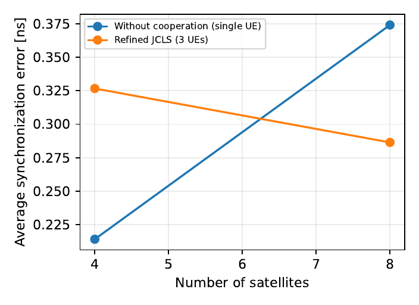
- Preview metadata: [previews/b6e7d8626dbe__outputs__migration_ladder__step_b_lm_residual_acceptance__tiny__sync_vary_ues.json](previews/b6e7d8626dbe__outputs__migration_ladder__step_b_lm_residual_acceptance__tiny__sync_vary_ues.json)
- Raw data:
  - [outputs/migration_ladder/step_b_lm_residual_acceptance/tiny/migration_arrays.npz](../migration_ladder/step_b_lm_residual_acceptance/tiny/migration_arrays.npz)
  - [outputs/migration_ladder/step_b_lm_residual_acceptance/tiny/migration_raw.csv](../migration_ladder/step_b_lm_residual_acceptance/tiny/migration_raw.csv)
  - [outputs/migration_ladder/step_b_lm_residual_acceptance/tiny/migration_summary.csv](../migration_ladder/step_b_lm_residual_acceptance/tiny/migration_summary.csv)
- Nearby metadata:
  - [outputs/migration_ladder/step_b_lm_residual_acceptance/tiny/migration_step_metadata.json](../migration_ladder/step_b_lm_residual_acceptance/tiny/migration_step_metadata.json)

### pos_vary_ues.pdf

- Status: `legacy_network_size_medium_replayed_unverified_match`
- Manuscript ready: `False`
- Source PDF: [outputs/migration_ladder/step_c0_legacy_map_instrumented/medium/pos_vary_ues.pdf](../migration_ladder/step_c0_legacy_map_instrumented/medium/pos_vary_ues.pdf)
- Warning: Legacy-compatible network-size medium replay completed under canonical outputs; match is unverified and legacy caveats remain.

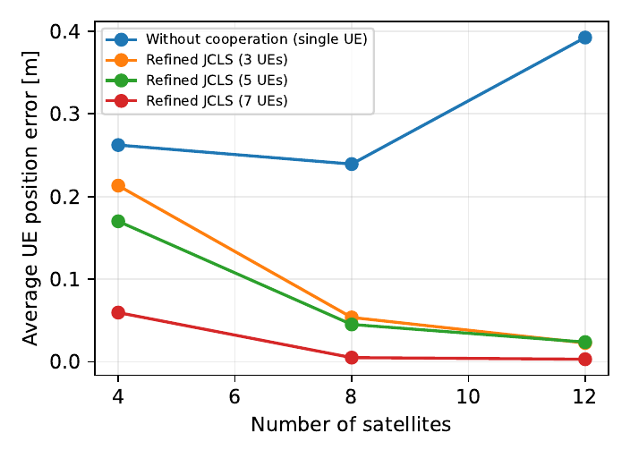
- Preview metadata: [previews/0b695870ba34__outputs__migration_ladder__step_c0_legacy_map_instrumented__medium__pos_vary_ues.json](previews/0b695870ba34__outputs__migration_ladder__step_c0_legacy_map_instrumented__medium__pos_vary_ues.json)
- Raw data:
  - [outputs/migration_ladder/step_c0_legacy_map_instrumented/medium/migration_arrays.npz](../migration_ladder/step_c0_legacy_map_instrumented/medium/migration_arrays.npz)
  - [outputs/migration_ladder/step_c0_legacy_map_instrumented/medium/migration_raw.csv](../migration_ladder/step_c0_legacy_map_instrumented/medium/migration_raw.csv)
  - [outputs/migration_ladder/step_c0_legacy_map_instrumented/medium/migration_summary.csv](../migration_ladder/step_c0_legacy_map_instrumented/medium/migration_summary.csv)
- Nearby metadata:
  - [outputs/migration_ladder/step_c0_legacy_map_instrumented/medium/migration_step_metadata.json](../migration_ladder/step_c0_legacy_map_instrumented/medium/migration_step_metadata.json)

### sync_vary_ues.pdf

- Status: `legacy_network_size_medium_replayed_unverified_match`
- Manuscript ready: `False`
- Source PDF: [outputs/migration_ladder/step_c0_legacy_map_instrumented/medium/sync_vary_ues.pdf](../migration_ladder/step_c0_legacy_map_instrumented/medium/sync_vary_ues.pdf)
- Warning: Legacy-compatible network-size medium replay completed under canonical outputs; match is unverified and legacy caveats remain.

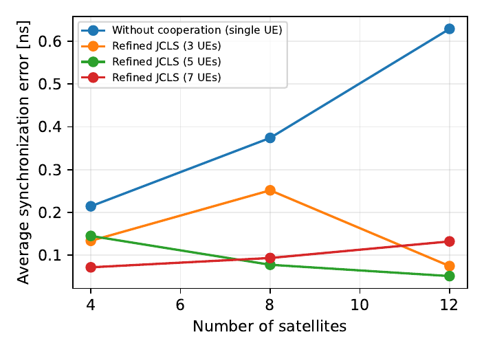
- Preview metadata: [previews/1c048c9aef4f__outputs__migration_ladder__step_c0_legacy_map_instrumented__medium__sync_vary_ues.json](previews/1c048c9aef4f__outputs__migration_ladder__step_c0_legacy_map_instrumented__medium__sync_vary_ues.json)
- Raw data:
  - [outputs/migration_ladder/step_c0_legacy_map_instrumented/medium/migration_arrays.npz](../migration_ladder/step_c0_legacy_map_instrumented/medium/migration_arrays.npz)
  - [outputs/migration_ladder/step_c0_legacy_map_instrumented/medium/migration_raw.csv](../migration_ladder/step_c0_legacy_map_instrumented/medium/migration_raw.csv)
  - [outputs/migration_ladder/step_c0_legacy_map_instrumented/medium/migration_summary.csv](../migration_ladder/step_c0_legacy_map_instrumented/medium/migration_summary.csv)
- Nearby metadata:
  - [outputs/migration_ladder/step_c0_legacy_map_instrumented/medium/migration_step_metadata.json](../migration_ladder/step_c0_legacy_map_instrumented/medium/migration_step_metadata.json)

### pos_vary_ues.pdf

- Status: `legacy_network_size_medium_replayed_unverified_match`
- Manuscript ready: `False`
- Source PDF: [outputs/migration_ladder/step_c0_legacy_map_instrumented/tiny/pos_vary_ues.pdf](../migration_ladder/step_c0_legacy_map_instrumented/tiny/pos_vary_ues.pdf)
- Warning: Legacy-compatible network-size medium replay completed under canonical outputs; match is unverified and legacy caveats remain.

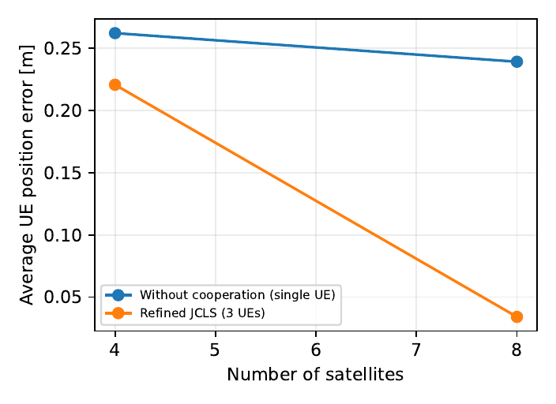
- Preview metadata: [previews/a6e6f3c97874__outputs__migration_ladder__step_c0_legacy_map_instrumented__tiny__pos_vary_ues.json](previews/a6e6f3c97874__outputs__migration_ladder__step_c0_legacy_map_instrumented__tiny__pos_vary_ues.json)
- Raw data:
  - [outputs/migration_ladder/step_c0_legacy_map_instrumented/tiny/migration_arrays.npz](../migration_ladder/step_c0_legacy_map_instrumented/tiny/migration_arrays.npz)
  - [outputs/migration_ladder/step_c0_legacy_map_instrumented/tiny/migration_raw.csv](../migration_ladder/step_c0_legacy_map_instrumented/tiny/migration_raw.csv)
  - [outputs/migration_ladder/step_c0_legacy_map_instrumented/tiny/migration_summary.csv](../migration_ladder/step_c0_legacy_map_instrumented/tiny/migration_summary.csv)
- Nearby metadata:
  - [outputs/migration_ladder/step_c0_legacy_map_instrumented/tiny/migration_step_metadata.json](../migration_ladder/step_c0_legacy_map_instrumented/tiny/migration_step_metadata.json)

### sync_vary_ues.pdf

- Status: `legacy_network_size_medium_replayed_unverified_match`
- Manuscript ready: `False`
- Source PDF: [outputs/migration_ladder/step_c0_legacy_map_instrumented/tiny/sync_vary_ues.pdf](../migration_ladder/step_c0_legacy_map_instrumented/tiny/sync_vary_ues.pdf)
- Warning: Legacy-compatible network-size medium replay completed under canonical outputs; match is unverified and legacy caveats remain.

- Preview metadata: [previews/027fab6ade0d__outputs__migration_ladder__step_c0_legacy_map_instrumented__tiny__sync_vary_ues.json](previews/027fab6ade0d__outputs__migration_ladder__step_c0_legacy_map_instrumented__tiny__sync_vary_ues.json)
- Raw data:
  - [outputs/migration_ladder/step_c0_legacy_map_instrumented/tiny/migration_arrays.npz](../migration_ladder/step_c0_legacy_map_instrumented/tiny/migration_arrays.npz)
  - [outputs/migration_ladder/step_c0_legacy_map_instrumented/tiny/migration_raw.csv](../migration_ladder/step_c0_legacy_map_instrumented/tiny/migration_raw.csv)
  - [outputs/migration_ladder/step_c0_legacy_map_instrumented/tiny/migration_summary.csv](../migration_ladder/step_c0_legacy_map_instrumented/tiny/migration_summary.csv)
- Nearby metadata:
  - [outputs/migration_ladder/step_c0_legacy_map_instrumented/tiny/migration_step_metadata.json](../migration_ladder/step_c0_legacy_map_instrumented/tiny/migration_step_metadata.json)

### pos_vary_ues.pdf

- Status: `legacy_network_size_medium_replayed_unverified_match`
- Manuscript ready: `False`
- Source PDF: [outputs/migration_ladder/step_c0_legacy_map_instrumented/tiny_bounded/pos_vary_ues.pdf](../migration_ladder/step_c0_legacy_map_instrumented/tiny_bounded/pos_vary_ues.pdf)
- Warning: Legacy-compatible network-size medium replay completed under canonical outputs; match is unverified and legacy caveats remain.

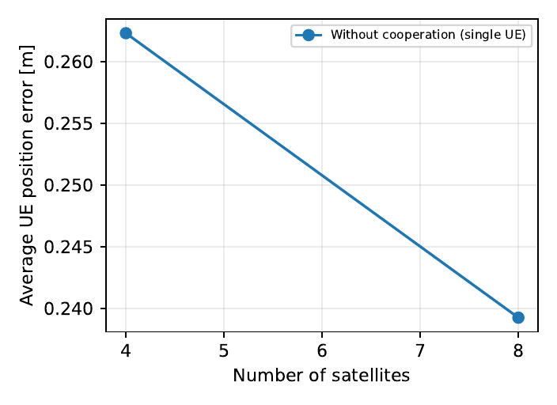
- Preview metadata: [previews/9e9395ba422e__outputs__migration_ladder__step_c0_legacy_map_instrumented__tiny_bounded__pos_vary_ues.json](previews/9e9395ba422e__outputs__migration_ladder__step_c0_legacy_map_instrumented__tiny_bounded__pos_vary_ues.json)
- Raw data:
  - [outputs/migration_ladder/step_c0_legacy_map_instrumented/tiny_bounded/migration_arrays.npz](../migration_ladder/step_c0_legacy_map_instrumented/tiny_bounded/migration_arrays.npz)
  - [outputs/migration_ladder/step_c0_legacy_map_instrumented/tiny_bounded/migration_raw.csv](../migration_ladder/step_c0_legacy_map_instrumented/tiny_bounded/migration_raw.csv)
  - [outputs/migration_ladder/step_c0_legacy_map_instrumented/tiny_bounded/migration_summary.csv](../migration_ladder/step_c0_legacy_map_instrumented/tiny_bounded/migration_summary.csv)
- Nearby metadata:
  - [outputs/migration_ladder/step_c0_legacy_map_instrumented/tiny_bounded/migration_step_metadata.json](../migration_ladder/step_c0_legacy_map_instrumented/tiny_bounded/migration_step_metadata.json)

### sync_vary_ues.pdf

- Status: `legacy_network_size_medium_replayed_unverified_match`
- Manuscript ready: `False`
- Source PDF: [outputs/migration_ladder/step_c0_legacy_map_instrumented/tiny_bounded/sync_vary_ues.pdf](../migration_ladder/step_c0_legacy_map_instrumented/tiny_bounded/sync_vary_ues.pdf)
- Warning: Legacy-compatible network-size medium replay completed under canonical outputs; match is unverified and legacy caveats remain.

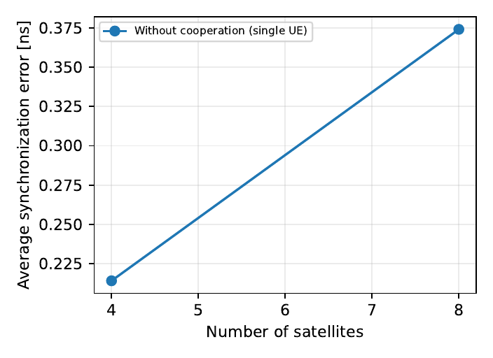
- Preview metadata: [previews/d55912b97639__outputs__migration_ladder__step_c0_legacy_map_instrumented__tiny_bounded__sync_vary_ues.json](previews/d55912b97639__outputs__migration_ladder__step_c0_legacy_map_instrumented__tiny_bounded__sync_vary_ues.json)
- Raw data:
  - [outputs/migration_ladder/step_c0_legacy_map_instrumented/tiny_bounded/migration_arrays.npz](../migration_ladder/step_c0_legacy_map_instrumented/tiny_bounded/migration_arrays.npz)
  - [outputs/migration_ladder/step_c0_legacy_map_instrumented/tiny_bounded/migration_raw.csv](../migration_ladder/step_c0_legacy_map_instrumented/tiny_bounded/migration_raw.csv)
  - [outputs/migration_ladder/step_c0_legacy_map_instrumented/tiny_bounded/migration_summary.csv](../migration_ladder/step_c0_legacy_map_instrumented/tiny_bounded/migration_summary.csv)
- Nearby metadata:
  - [outputs/migration_ladder/step_c0_legacy_map_instrumented/tiny_bounded/migration_step_metadata.json](../migration_ladder/step_c0_legacy_map_instrumented/tiny_bounded/migration_step_metadata.json)

### pos_vary_ues.pdf

- Status: `legacy_network_size_medium_replayed_unverified_match`
- Manuscript ready: `False`
- Source PDF: [outputs/migration_ladder/step_c1_legacy_cov_observable_acceptance/medium/pos_vary_ues.pdf](../migration_ladder/step_c1_legacy_cov_observable_acceptance/medium/pos_vary_ues.pdf)
- Warning: Legacy-compatible network-size medium replay completed under canonical outputs; match is unverified and legacy caveats remain.

- Preview metadata: [previews/5d768626f7e1__outputs__migration_ladder__step_c1_legacy_cov_observable_acceptance__medium__pos_vary_ues.json](previews/5d768626f7e1__outputs__migration_ladder__step_c1_legacy_cov_observable_acceptance__medium__pos_vary_ues.json)
- Raw data:
  - [outputs/migration_ladder/step_c1_legacy_cov_observable_acceptance/medium/migration_arrays.npz](../migration_ladder/step_c1_legacy_cov_observable_acceptance/medium/migration_arrays.npz)
  - [outputs/migration_ladder/step_c1_legacy_cov_observable_acceptance/medium/migration_raw.csv](../migration_ladder/step_c1_legacy_cov_observable_acceptance/medium/migration_raw.csv)
  - [outputs/migration_ladder/step_c1_legacy_cov_observable_acceptance/medium/migration_summary.csv](../migration_ladder/step_c1_legacy_cov_observable_acceptance/medium/migration_summary.csv)
- Nearby metadata:
  - [outputs/migration_ladder/step_c1_legacy_cov_observable_acceptance/medium/migration_step_metadata.json](../migration_ladder/step_c1_legacy_cov_observable_acceptance/medium/migration_step_metadata.json)

### sync_vary_ues.pdf

- Status: `legacy_network_size_medium_replayed_unverified_match`
- Manuscript ready: `False`
- Source PDF: [outputs/migration_ladder/step_c1_legacy_cov_observable_acceptance/medium/sync_vary_ues.pdf](../migration_ladder/step_c1_legacy_cov_observable_acceptance/medium/sync_vary_ues.pdf)
- Warning: Legacy-compatible network-size medium replay completed under canonical outputs; match is unverified and legacy caveats remain.

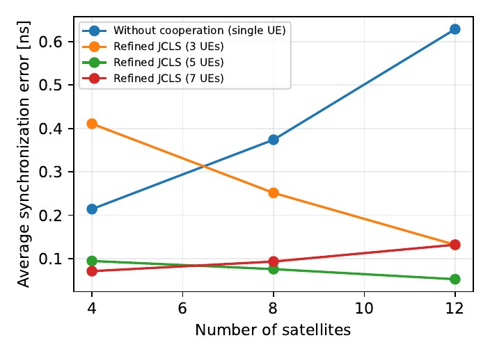
- Preview metadata: [previews/a9727ff0a19b__outputs__migration_ladder__step_c1_legacy_cov_observable_acceptance__medium__sync_vary_ues.json](previews/a9727ff0a19b__outputs__migration_ladder__step_c1_legacy_cov_observable_acceptance__medium__sync_vary_ues.json)
- Raw data:
  - [outputs/migration_ladder/step_c1_legacy_cov_observable_acceptance/medium/migration_arrays.npz](../migration_ladder/step_c1_legacy_cov_observable_acceptance/medium/migration_arrays.npz)
  - [outputs/migration_ladder/step_c1_legacy_cov_observable_acceptance/medium/migration_raw.csv](../migration_ladder/step_c1_legacy_cov_observable_acceptance/medium/migration_raw.csv)
  - [outputs/migration_ladder/step_c1_legacy_cov_observable_acceptance/medium/migration_summary.csv](../migration_ladder/step_c1_legacy_cov_observable_acceptance/medium/migration_summary.csv)
- Nearby metadata:
  - [outputs/migration_ladder/step_c1_legacy_cov_observable_acceptance/medium/migration_step_metadata.json](../migration_ladder/step_c1_legacy_cov_observable_acceptance/medium/migration_step_metadata.json)

### pos_vary_ues.pdf

- Status: `legacy_network_size_medium_replayed_unverified_match`
- Manuscript ready: `False`
- Source PDF: [outputs/migration_ladder/step_c1_legacy_cov_observable_acceptance/tiny/pos_vary_ues.pdf](../migration_ladder/step_c1_legacy_cov_observable_acceptance/tiny/pos_vary_ues.pdf)
- Warning: Legacy-compatible network-size medium replay completed under canonical outputs; match is unverified and legacy caveats remain.

- Preview metadata: [previews/3c04ccb4c988__outputs__migration_ladder__step_c1_legacy_cov_observable_acceptance__tiny__pos_vary_ues.json](previews/3c04ccb4c988__outputs__migration_ladder__step_c1_legacy_cov_observable_acceptance__tiny__pos_vary_ues.json)
- Raw data:
  - [outputs/migration_ladder/step_c1_legacy_cov_observable_acceptance/tiny/migration_arrays.npz](../migration_ladder/step_c1_legacy_cov_observable_acceptance/tiny/migration_arrays.npz)
  - [outputs/migration_ladder/step_c1_legacy_cov_observable_acceptance/tiny/migration_raw.csv](../migration_ladder/step_c1_legacy_cov_observable_acceptance/tiny/migration_raw.csv)
  - [outputs/migration_ladder/step_c1_legacy_cov_observable_acceptance/tiny/migration_summary.csv](../migration_ladder/step_c1_legacy_cov_observable_acceptance/tiny/migration_summary.csv)
- Nearby metadata:
  - [outputs/migration_ladder/step_c1_legacy_cov_observable_acceptance/tiny/migration_step_metadata.json](../migration_ladder/step_c1_legacy_cov_observable_acceptance/tiny/migration_step_metadata.json)

### sync_vary_ues.pdf

- Status: `legacy_network_size_medium_replayed_unverified_match`
- Manuscript ready: `False`
- Source PDF: [outputs/migration_ladder/step_c1_legacy_cov_observable_acceptance/tiny/sync_vary_ues.pdf](../migration_ladder/step_c1_legacy_cov_observable_acceptance/tiny/sync_vary_ues.pdf)
- Warning: Legacy-compatible network-size medium replay completed under canonical outputs; match is unverified and legacy caveats remain.

- Preview metadata: [previews/7cc7eccb1453__outputs__migration_ladder__step_c1_legacy_cov_observable_acceptance__tiny__sync_vary_ues.json](previews/7cc7eccb1453__outputs__migration_ladder__step_c1_legacy_cov_observable_acceptance__tiny__sync_vary_ues.json)
- Raw data:
  - [outputs/migration_ladder/step_c1_legacy_cov_observable_acceptance/tiny/migration_arrays.npz](../migration_ladder/step_c1_legacy_cov_observable_acceptance/tiny/migration_arrays.npz)
  - [outputs/migration_ladder/step_c1_legacy_cov_observable_acceptance/tiny/migration_raw.csv](../migration_ladder/step_c1_legacy_cov_observable_acceptance/tiny/migration_raw.csv)
  - [outputs/migration_ladder/step_c1_legacy_cov_observable_acceptance/tiny/migration_summary.csv](../migration_ladder/step_c1_legacy_cov_observable_acceptance/tiny/migration_summary.csv)
- Nearby metadata:
  - [outputs/migration_ladder/step_c1_legacy_cov_observable_acceptance/tiny/migration_step_metadata.json](../migration_ladder/step_c1_legacy_cov_observable_acceptance/tiny/migration_step_metadata.json)

### pos_vary_ues.pdf

- Status: `legacy_network_size_medium_replayed_unverified_match`
- Manuscript ready: `False`
- Source PDF: [outputs/migration_ladder/step_c2_observable_cov_legacy_acceptance/medium/pos_vary_ues.pdf](../migration_ladder/step_c2_observable_cov_legacy_acceptance/medium/pos_vary_ues.pdf)
- Warning: Legacy-compatible network-size medium replay completed under canonical outputs; match is unverified and legacy caveats remain.

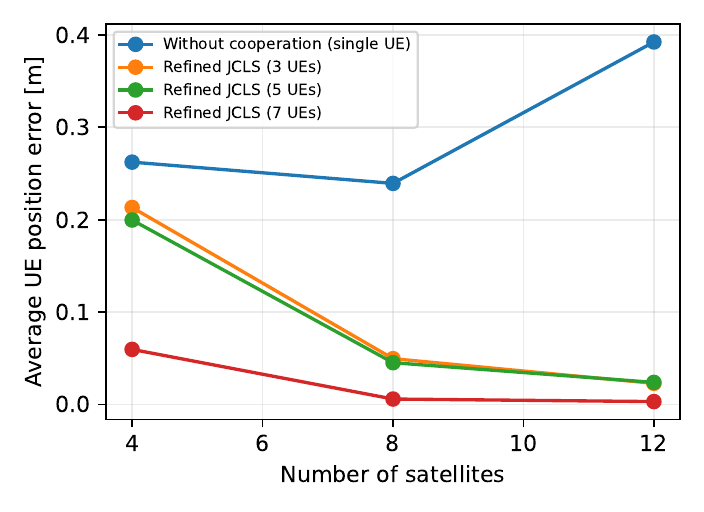
- Preview metadata: [previews/1b3301ff9127__outputs__migration_ladder__step_c2_observable_cov_legacy_acceptance__medium__pos_vary_ues.json](previews/1b3301ff9127__outputs__migration_ladder__step_c2_observable_cov_legacy_acceptance__medium__pos_vary_ues.json)
- Raw data:
  - [outputs/migration_ladder/step_c2_observable_cov_legacy_acceptance/medium/migration_arrays.npz](../migration_ladder/step_c2_observable_cov_legacy_acceptance/medium/migration_arrays.npz)
  - [outputs/migration_ladder/step_c2_observable_cov_legacy_acceptance/medium/migration_raw.csv](../migration_ladder/step_c2_observable_cov_legacy_acceptance/medium/migration_raw.csv)
  - [outputs/migration_ladder/step_c2_observable_cov_legacy_acceptance/medium/migration_summary.csv](../migration_ladder/step_c2_observable_cov_legacy_acceptance/medium/migration_summary.csv)
- Nearby metadata:
  - [outputs/migration_ladder/step_c2_observable_cov_legacy_acceptance/medium/migration_step_metadata.json](../migration_ladder/step_c2_observable_cov_legacy_acceptance/medium/migration_step_metadata.json)

### sync_vary_ues.pdf

- Status: `legacy_network_size_medium_replayed_unverified_match`
- Manuscript ready: `False`
- Source PDF: [outputs/migration_ladder/step_c2_observable_cov_legacy_acceptance/medium/sync_vary_ues.pdf](../migration_ladder/step_c2_observable_cov_legacy_acceptance/medium/sync_vary_ues.pdf)
- Warning: Legacy-compatible network-size medium replay completed under canonical outputs; match is unverified and legacy caveats remain.

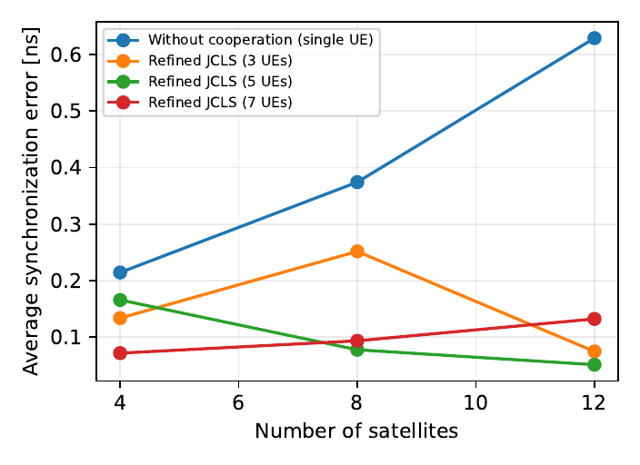
- Preview metadata: [previews/3787abd6210c__outputs__migration_ladder__step_c2_observable_cov_legacy_acceptance__medium__sync_vary_ues.json](previews/3787abd6210c__outputs__migration_ladder__step_c2_observable_cov_legacy_acceptance__medium__sync_vary_ues.json)
- Raw data:
  - [outputs/migration_ladder/step_c2_observable_cov_legacy_acceptance/medium/migration_arrays.npz](../migration_ladder/step_c2_observable_cov_legacy_acceptance/medium/migration_arrays.npz)
  - [outputs/migration_ladder/step_c2_observable_cov_legacy_acceptance/medium/migration_raw.csv](../migration_ladder/step_c2_observable_cov_legacy_acceptance/medium/migration_raw.csv)
  - [outputs/migration_ladder/step_c2_observable_cov_legacy_acceptance/medium/migration_summary.csv](../migration_ladder/step_c2_observable_cov_legacy_acceptance/medium/migration_summary.csv)
- Nearby metadata:
  - [outputs/migration_ladder/step_c2_observable_cov_legacy_acceptance/medium/migration_step_metadata.json](../migration_ladder/step_c2_observable_cov_legacy_acceptance/medium/migration_step_metadata.json)

### pos_vary_ues.pdf

- Status: `legacy_network_size_medium_replayed_unverified_match`
- Manuscript ready: `False`
- Source PDF: [outputs/migration_ladder/step_c2_observable_cov_legacy_acceptance/tiny/pos_vary_ues.pdf](../migration_ladder/step_c2_observable_cov_legacy_acceptance/tiny/pos_vary_ues.pdf)
- Warning: Legacy-compatible network-size medium replay completed under canonical outputs; match is unverified and legacy caveats remain.

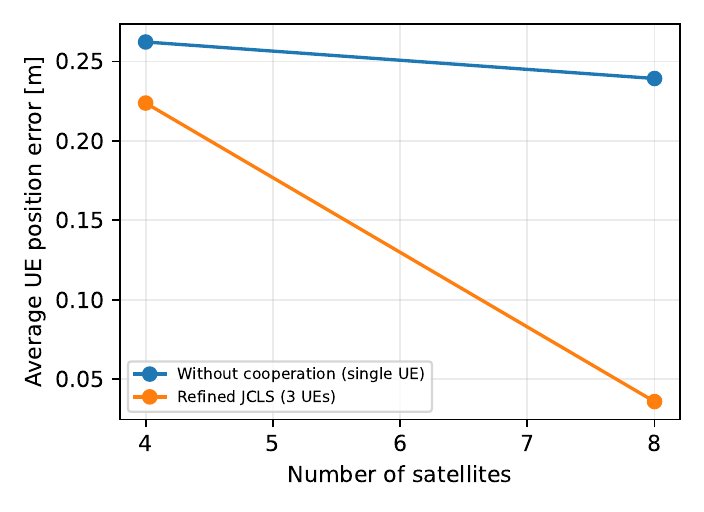
- Preview metadata: [previews/493b63bbd9a1__outputs__migration_ladder__step_c2_observable_cov_legacy_acceptance__tiny__pos_vary_ues.json](previews/493b63bbd9a1__outputs__migration_ladder__step_c2_observable_cov_legacy_acceptance__tiny__pos_vary_ues.json)
- Raw data:
  - [outputs/migration_ladder/step_c2_observable_cov_legacy_acceptance/tiny/migration_arrays.npz](../migration_ladder/step_c2_observable_cov_legacy_acceptance/tiny/migration_arrays.npz)
  - [outputs/migration_ladder/step_c2_observable_cov_legacy_acceptance/tiny/migration_raw.csv](../migration_ladder/step_c2_observable_cov_legacy_acceptance/tiny/migration_raw.csv)
  - [outputs/migration_ladder/step_c2_observable_cov_legacy_acceptance/tiny/migration_summary.csv](../migration_ladder/step_c2_observable_cov_legacy_acceptance/tiny/migration_summary.csv)
- Nearby metadata:
  - [outputs/migration_ladder/step_c2_observable_cov_legacy_acceptance/tiny/migration_step_metadata.json](../migration_ladder/step_c2_observable_cov_legacy_acceptance/tiny/migration_step_metadata.json)

### sync_vary_ues.pdf

- Status: `legacy_network_size_medium_replayed_unverified_match`
- Manuscript ready: `False`
- Source PDF: [outputs/migration_ladder/step_c2_observable_cov_legacy_acceptance/tiny/sync_vary_ues.pdf](../migration_ladder/step_c2_observable_cov_legacy_acceptance/tiny/sync_vary_ues.pdf)
- Warning: Legacy-compatible network-size medium replay completed under canonical outputs; match is unverified and legacy caveats remain.

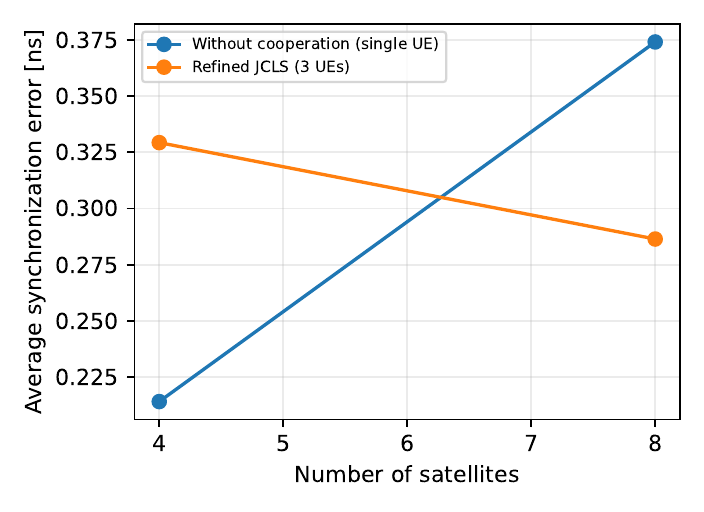
- Preview metadata: [previews/8d96821855a8__outputs__migration_ladder__step_c2_observable_cov_legacy_acceptance__tiny__sync_vary_ues.json](previews/8d96821855a8__outputs__migration_ladder__step_c2_observable_cov_legacy_acceptance__tiny__sync_vary_ues.json)
- Raw data:
  - [outputs/migration_ladder/step_c2_observable_cov_legacy_acceptance/tiny/migration_arrays.npz](../migration_ladder/step_c2_observable_cov_legacy_acceptance/tiny/migration_arrays.npz)
  - [outputs/migration_ladder/step_c2_observable_cov_legacy_acceptance/tiny/migration_raw.csv](../migration_ladder/step_c2_observable_cov_legacy_acceptance/tiny/migration_raw.csv)
  - [outputs/migration_ladder/step_c2_observable_cov_legacy_acceptance/tiny/migration_summary.csv](../migration_ladder/step_c2_observable_cov_legacy_acceptance/tiny/migration_summary.csv)
- Nearby metadata:
  - [outputs/migration_ladder/step_c2_observable_cov_legacy_acceptance/tiny/migration_step_metadata.json](../migration_ladder/step_c2_observable_cov_legacy_acceptance/tiny/migration_step_metadata.json)

### pos_vary_ues.pdf

- Status: `legacy_network_size_medium_replayed_unverified_match`
- Manuscript ready: `False`
- Source PDF: [outputs/migration_ladder/step_c3_cov_block_diag/medium/pos_vary_ues.pdf](../migration_ladder/step_c3_cov_block_diag/medium/pos_vary_ues.pdf)
- Warning: Legacy-compatible network-size medium replay completed under canonical outputs; match is unverified and legacy caveats remain.

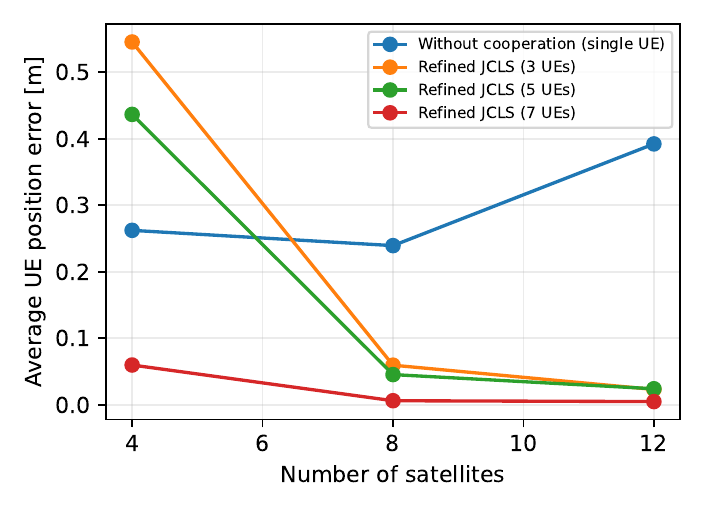
- Preview metadata: [previews/6883ceacf3fd__outputs__migration_ladder__step_c3_cov_block_diag__medium__pos_vary_ues.json](previews/6883ceacf3fd__outputs__migration_ladder__step_c3_cov_block_diag__medium__pos_vary_ues.json)
- Raw data:
  - [outputs/migration_ladder/step_c3_cov_block_diag/medium/migration_arrays.npz](../migration_ladder/step_c3_cov_block_diag/medium/migration_arrays.npz)
  - [outputs/migration_ladder/step_c3_cov_block_diag/medium/migration_raw.csv](../migration_ladder/step_c3_cov_block_diag/medium/migration_raw.csv)
  - [outputs/migration_ladder/step_c3_cov_block_diag/medium/migration_summary.csv](../migration_ladder/step_c3_cov_block_diag/medium/migration_summary.csv)
- Nearby metadata:
  - [outputs/migration_ladder/step_c3_cov_block_diag/medium/migration_step_metadata.json](../migration_ladder/step_c3_cov_block_diag/medium/migration_step_metadata.json)

### sync_vary_ues.pdf

- Status: `legacy_network_size_medium_replayed_unverified_match`
- Manuscript ready: `False`
- Source PDF: [outputs/migration_ladder/step_c3_cov_block_diag/medium/sync_vary_ues.pdf](../migration_ladder/step_c3_cov_block_diag/medium/sync_vary_ues.pdf)
- Warning: Legacy-compatible network-size medium replay completed under canonical outputs; match is unverified and legacy caveats remain.

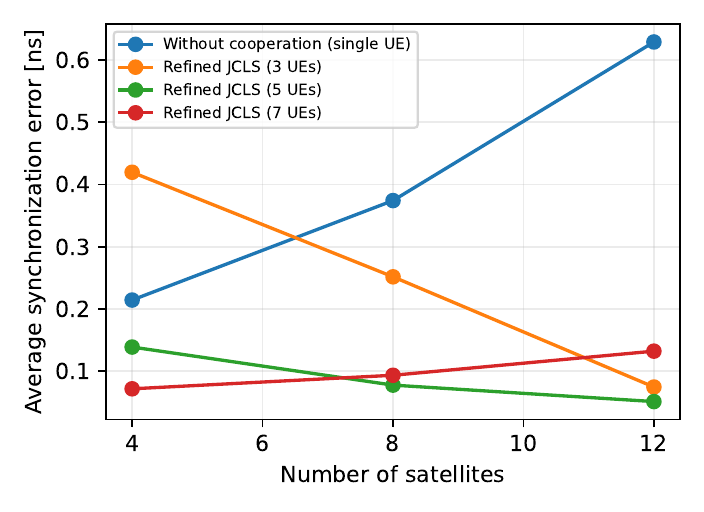
- Preview metadata: [previews/3517aaf9f492__outputs__migration_ladder__step_c3_cov_block_diag__medium__sync_vary_ues.json](previews/3517aaf9f492__outputs__migration_ladder__step_c3_cov_block_diag__medium__sync_vary_ues.json)
- Raw data:
  - [outputs/migration_ladder/step_c3_cov_block_diag/medium/migration_arrays.npz](../migration_ladder/step_c3_cov_block_diag/medium/migration_arrays.npz)
  - [outputs/migration_ladder/step_c3_cov_block_diag/medium/migration_raw.csv](../migration_ladder/step_c3_cov_block_diag/medium/migration_raw.csv)
  - [outputs/migration_ladder/step_c3_cov_block_diag/medium/migration_summary.csv](../migration_ladder/step_c3_cov_block_diag/medium/migration_summary.csv)
- Nearby metadata:
  - [outputs/migration_ladder/step_c3_cov_block_diag/medium/migration_step_metadata.json](../migration_ladder/step_c3_cov_block_diag/medium/migration_step_metadata.json)

### pos_vary_ues.pdf

- Status: `legacy_network_size_medium_replayed_unverified_match`
- Manuscript ready: `False`
- Source PDF: [outputs/migration_ladder/step_c3_cov_block_diag/tiny/pos_vary_ues.pdf](../migration_ladder/step_c3_cov_block_diag/tiny/pos_vary_ues.pdf)
- Warning: Legacy-compatible network-size medium replay completed under canonical outputs; match is unverified and legacy caveats remain.

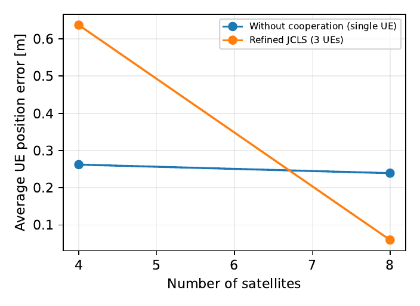
- Preview metadata: [previews/631efca683a8__outputs__migration_ladder__step_c3_cov_block_diag__tiny__pos_vary_ues.json](previews/631efca683a8__outputs__migration_ladder__step_c3_cov_block_diag__tiny__pos_vary_ues.json)
- Raw data:
  - [outputs/migration_ladder/step_c3_cov_block_diag/tiny/migration_arrays.npz](../migration_ladder/step_c3_cov_block_diag/tiny/migration_arrays.npz)
  - [outputs/migration_ladder/step_c3_cov_block_diag/tiny/migration_raw.csv](../migration_ladder/step_c3_cov_block_diag/tiny/migration_raw.csv)
  - [outputs/migration_ladder/step_c3_cov_block_diag/tiny/migration_summary.csv](../migration_ladder/step_c3_cov_block_diag/tiny/migration_summary.csv)
- Nearby metadata:
  - [outputs/migration_ladder/step_c3_cov_block_diag/tiny/migration_step_metadata.json](../migration_ladder/step_c3_cov_block_diag/tiny/migration_step_metadata.json)

### sync_vary_ues.pdf

- Status: `legacy_network_size_medium_replayed_unverified_match`
- Manuscript ready: `False`
- Source PDF: [outputs/migration_ladder/step_c3_cov_block_diag/tiny/sync_vary_ues.pdf](../migration_ladder/step_c3_cov_block_diag/tiny/sync_vary_ues.pdf)
- Warning: Legacy-compatible network-size medium replay completed under canonical outputs; match is unverified and legacy caveats remain.

- Preview metadata: [previews/82c27c7ff323__outputs__migration_ladder__step_c3_cov_block_diag__tiny__sync_vary_ues.json](previews/82c27c7ff323__outputs__migration_ladder__step_c3_cov_block_diag__tiny__sync_vary_ues.json)
- Raw data:
  - [outputs/migration_ladder/step_c3_cov_block_diag/tiny/migration_arrays.npz](../migration_ladder/step_c3_cov_block_diag/tiny/migration_arrays.npz)
  - [outputs/migration_ladder/step_c3_cov_block_diag/tiny/migration_raw.csv](../migration_ladder/step_c3_cov_block_diag/tiny/migration_raw.csv)
  - [outputs/migration_ladder/step_c3_cov_block_diag/tiny/migration_summary.csv](../migration_ladder/step_c3_cov_block_diag/tiny/migration_summary.csv)
- Nearby metadata:
  - [outputs/migration_ladder/step_c3_cov_block_diag/tiny/migration_step_metadata.json](../migration_ladder/step_c3_cov_block_diag/tiny/migration_step_metadata.json)

### pos_vary_ues.pdf

- Status: `legacy_network_size_medium_replayed_unverified_match`
- Manuscript ready: `False`
- Source PDF: [outputs/migration_ladder/step_c3_cov_damped_inverse/medium/pos_vary_ues.pdf](../migration_ladder/step_c3_cov_damped_inverse/medium/pos_vary_ues.pdf)
- Warning: Legacy-compatible network-size medium replay completed under canonical outputs; match is unverified and legacy caveats remain.

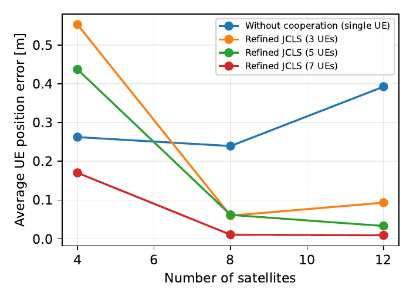
- Preview metadata: [previews/a83a69ca7201__outputs__migration_ladder__step_c3_cov_damped_inverse__medium__pos_vary_ues.json](previews/a83a69ca7201__outputs__migration_ladder__step_c3_cov_damped_inverse__medium__pos_vary_ues.json)
- Raw data:
  - [outputs/migration_ladder/step_c3_cov_damped_inverse/medium/migration_arrays.npz](../migration_ladder/step_c3_cov_damped_inverse/medium/migration_arrays.npz)
  - [outputs/migration_ladder/step_c3_cov_damped_inverse/medium/migration_raw.csv](../migration_ladder/step_c3_cov_damped_inverse/medium/migration_raw.csv)
  - [outputs/migration_ladder/step_c3_cov_damped_inverse/medium/migration_summary.csv](../migration_ladder/step_c3_cov_damped_inverse/medium/migration_summary.csv)
- Nearby metadata:
  - [outputs/migration_ladder/step_c3_cov_damped_inverse/medium/migration_step_metadata.json](../migration_ladder/step_c3_cov_damped_inverse/medium/migration_step_metadata.json)

### sync_vary_ues.pdf

- Status: `legacy_network_size_medium_replayed_unverified_match`
- Manuscript ready: `False`
- Source PDF: [outputs/migration_ladder/step_c3_cov_damped_inverse/medium/sync_vary_ues.pdf](../migration_ladder/step_c3_cov_damped_inverse/medium/sync_vary_ues.pdf)
- Warning: Legacy-compatible network-size medium replay completed under canonical outputs; match is unverified and legacy caveats remain.

- Preview metadata: [previews/3e29a5dfb05e__outputs__migration_ladder__step_c3_cov_damped_inverse__medium__sync_vary_ues.json](previews/3e29a5dfb05e__outputs__migration_ladder__step_c3_cov_damped_inverse__medium__sync_vary_ues.json)
- Raw data:
  - [outputs/migration_ladder/step_c3_cov_damped_inverse/medium/migration_arrays.npz](../migration_ladder/step_c3_cov_damped_inverse/medium/migration_arrays.npz)
  - [outputs/migration_ladder/step_c3_cov_damped_inverse/medium/migration_raw.csv](../migration_ladder/step_c3_cov_damped_inverse/medium/migration_raw.csv)
  - [outputs/migration_ladder/step_c3_cov_damped_inverse/medium/migration_summary.csv](../migration_ladder/step_c3_cov_damped_inverse/medium/migration_summary.csv)
- Nearby metadata:
  - [outputs/migration_ladder/step_c3_cov_damped_inverse/medium/migration_step_metadata.json](../migration_ladder/step_c3_cov_damped_inverse/medium/migration_step_metadata.json)

### pos_vary_ues.pdf

- Status: `legacy_network_size_medium_replayed_unverified_match`
- Manuscript ready: `False`
- Source PDF: [outputs/migration_ladder/step_c3_cov_damped_inverse/tiny/pos_vary_ues.pdf](../migration_ladder/step_c3_cov_damped_inverse/tiny/pos_vary_ues.pdf)
- Warning: Legacy-compatible network-size medium replay completed under canonical outputs; match is unverified and legacy caveats remain.

- Preview metadata: [previews/4cc61216d474__outputs__migration_ladder__step_c3_cov_damped_inverse__tiny__pos_vary_ues.json](previews/4cc61216d474__outputs__migration_ladder__step_c3_cov_damped_inverse__tiny__pos_vary_ues.json)
- Raw data:
  - [outputs/migration_ladder/step_c3_cov_damped_inverse/tiny/migration_arrays.npz](../migration_ladder/step_c3_cov_damped_inverse/tiny/migration_arrays.npz)
  - [outputs/migration_ladder/step_c3_cov_damped_inverse/tiny/migration_raw.csv](../migration_ladder/step_c3_cov_damped_inverse/tiny/migration_raw.csv)
  - [outputs/migration_ladder/step_c3_cov_damped_inverse/tiny/migration_summary.csv](../migration_ladder/step_c3_cov_damped_inverse/tiny/migration_summary.csv)
- Nearby metadata:
  - [outputs/migration_ladder/step_c3_cov_damped_inverse/tiny/migration_step_metadata.json](../migration_ladder/step_c3_cov_damped_inverse/tiny/migration_step_metadata.json)

### sync_vary_ues.pdf

- Status: `legacy_network_size_medium_replayed_unverified_match`
- Manuscript ready: `False`
- Source PDF: [outputs/migration_ladder/step_c3_cov_damped_inverse/tiny/sync_vary_ues.pdf](../migration_ladder/step_c3_cov_damped_inverse/tiny/sync_vary_ues.pdf)
- Warning: Legacy-compatible network-size medium replay completed under canonical outputs; match is unverified and legacy caveats remain.

- Preview metadata: [previews/af510949672e__outputs__migration_ladder__step_c3_cov_damped_inverse__tiny__sync_vary_ues.json](previews/af510949672e__outputs__migration_ladder__step_c3_cov_damped_inverse__tiny__sync_vary_ues.json)
- Raw data:
  - [outputs/migration_ladder/step_c3_cov_damped_inverse/tiny/migration_arrays.npz](../migration_ladder/step_c3_cov_damped_inverse/tiny/migration_arrays.npz)
  - [outputs/migration_ladder/step_c3_cov_damped_inverse/tiny/migration_raw.csv](../migration_ladder/step_c3_cov_damped_inverse/tiny/migration_raw.csv)
  - [outputs/migration_ladder/step_c3_cov_damped_inverse/tiny/migration_summary.csv](../migration_ladder/step_c3_cov_damped_inverse/tiny/migration_summary.csv)
- Nearby metadata:
  - [outputs/migration_ladder/step_c3_cov_damped_inverse/tiny/migration_step_metadata.json](../migration_ladder/step_c3_cov_damped_inverse/tiny/migration_step_metadata.json)

### pos_vary_ues.pdf

- Status: `legacy_network_size_medium_replayed_unverified_match`
- Manuscript ready: `False`
- Source PDF: [outputs/migration_ladder/step_c3_cov_damped_pinv/medium/pos_vary_ues.pdf](../migration_ladder/step_c3_cov_damped_pinv/medium/pos_vary_ues.pdf)
- Warning: Legacy-compatible network-size medium replay completed under canonical outputs; match is unverified and legacy caveats remain.

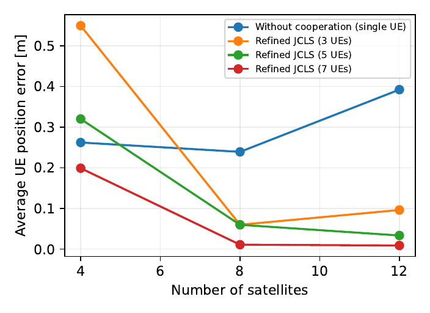
- Preview metadata: [previews/ace76f8a9661__outputs__migration_ladder__step_c3_cov_damped_pinv__medium__pos_vary_ues.json](previews/ace76f8a9661__outputs__migration_ladder__step_c3_cov_damped_pinv__medium__pos_vary_ues.json)
- Raw data:
  - [outputs/migration_ladder/step_c3_cov_damped_pinv/medium/migration_arrays.npz](../migration_ladder/step_c3_cov_damped_pinv/medium/migration_arrays.npz)
  - [outputs/migration_ladder/step_c3_cov_damped_pinv/medium/migration_raw.csv](../migration_ladder/step_c3_cov_damped_pinv/medium/migration_raw.csv)
  - [outputs/migration_ladder/step_c3_cov_damped_pinv/medium/migration_summary.csv](../migration_ladder/step_c3_cov_damped_pinv/medium/migration_summary.csv)
- Nearby metadata:
  - [outputs/migration_ladder/step_c3_cov_damped_pinv/medium/migration_step_metadata.json](../migration_ladder/step_c3_cov_damped_pinv/medium/migration_step_metadata.json)

### sync_vary_ues.pdf

- Status: `legacy_network_size_medium_replayed_unverified_match`
- Manuscript ready: `False`
- Source PDF: [outputs/migration_ladder/step_c3_cov_damped_pinv/medium/sync_vary_ues.pdf](../migration_ladder/step_c3_cov_damped_pinv/medium/sync_vary_ues.pdf)
- Warning: Legacy-compatible network-size medium replay completed under canonical outputs; match is unverified and legacy caveats remain.

- Preview metadata: [previews/41d79dc0688a__outputs__migration_ladder__step_c3_cov_damped_pinv__medium__sync_vary_ues.json](previews/41d79dc0688a__outputs__migration_ladder__step_c3_cov_damped_pinv__medium__sync_vary_ues.json)
- Raw data:
  - [outputs/migration_ladder/step_c3_cov_damped_pinv/medium/migration_arrays.npz](../migration_ladder/step_c3_cov_damped_pinv/medium/migration_arrays.npz)
  - [outputs/migration_ladder/step_c3_cov_damped_pinv/medium/migration_raw.csv](../migration_ladder/step_c3_cov_damped_pinv/medium/migration_raw.csv)
  - [outputs/migration_ladder/step_c3_cov_damped_pinv/medium/migration_summary.csv](../migration_ladder/step_c3_cov_damped_pinv/medium/migration_summary.csv)
- Nearby metadata:
  - [outputs/migration_ladder/step_c3_cov_damped_pinv/medium/migration_step_metadata.json](../migration_ladder/step_c3_cov_damped_pinv/medium/migration_step_metadata.json)

### pos_vary_ues.pdf

- Status: `legacy_network_size_medium_replayed_unverified_match`
- Manuscript ready: `False`
- Source PDF: [outputs/migration_ladder/step_c3_cov_damped_pinv/tiny/pos_vary_ues.pdf](../migration_ladder/step_c3_cov_damped_pinv/tiny/pos_vary_ues.pdf)
- Warning: Legacy-compatible network-size medium replay completed under canonical outputs; match is unverified and legacy caveats remain.

- Preview metadata: [previews/166efc93db9a__outputs__migration_ladder__step_c3_cov_damped_pinv__tiny__pos_vary_ues.json](previews/166efc93db9a__outputs__migration_ladder__step_c3_cov_damped_pinv__tiny__pos_vary_ues.json)
- Raw data:
  - [outputs/migration_ladder/step_c3_cov_damped_pinv/tiny/migration_arrays.npz](../migration_ladder/step_c3_cov_damped_pinv/tiny/migration_arrays.npz)
  - [outputs/migration_ladder/step_c3_cov_damped_pinv/tiny/migration_raw.csv](../migration_ladder/step_c3_cov_damped_pinv/tiny/migration_raw.csv)
  - [outputs/migration_ladder/step_c3_cov_damped_pinv/tiny/migration_summary.csv](../migration_ladder/step_c3_cov_damped_pinv/tiny/migration_summary.csv)
- Nearby metadata:
  - [outputs/migration_ladder/step_c3_cov_damped_pinv/tiny/migration_step_metadata.json](../migration_ladder/step_c3_cov_damped_pinv/tiny/migration_step_metadata.json)

### sync_vary_ues.pdf

- Status: `legacy_network_size_medium_replayed_unverified_match`
- Manuscript ready: `False`
- Source PDF: [outputs/migration_ladder/step_c3_cov_damped_pinv/tiny/sync_vary_ues.pdf](../migration_ladder/step_c3_cov_damped_pinv/tiny/sync_vary_ues.pdf)
- Warning: Legacy-compatible network-size medium replay completed under canonical outputs; match is unverified and legacy caveats remain.

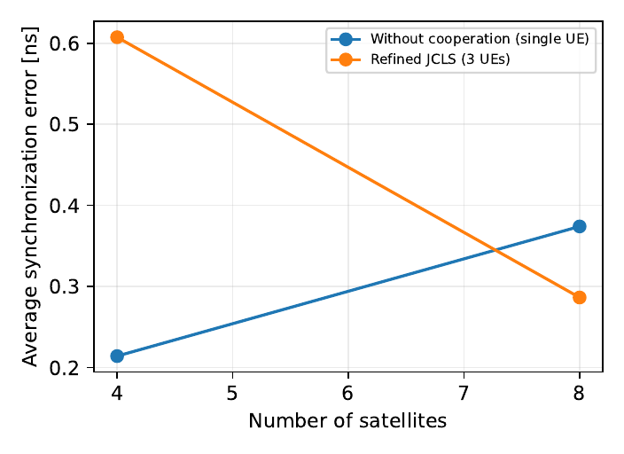
- Preview metadata: [previews/051d3482d1fb__outputs__migration_ladder__step_c3_cov_damped_pinv__tiny__sync_vary_ues.json](previews/051d3482d1fb__outputs__migration_ladder__step_c3_cov_damped_pinv__tiny__sync_vary_ues.json)
- Raw data:
  - [outputs/migration_ladder/step_c3_cov_damped_pinv/tiny/migration_arrays.npz](../migration_ladder/step_c3_cov_damped_pinv/tiny/migration_arrays.npz)
  - [outputs/migration_ladder/step_c3_cov_damped_pinv/tiny/migration_raw.csv](../migration_ladder/step_c3_cov_damped_pinv/tiny/migration_raw.csv)
  - [outputs/migration_ladder/step_c3_cov_damped_pinv/tiny/migration_summary.csv](../migration_ladder/step_c3_cov_damped_pinv/tiny/migration_summary.csv)
- Nearby metadata:
  - [outputs/migration_ladder/step_c3_cov_damped_pinv/tiny/migration_step_metadata.json](../migration_ladder/step_c3_cov_damped_pinv/tiny/migration_step_metadata.json)

### pos_vary_ues.pdf

- Status: `legacy_network_size_medium_replayed_unverified_match`
- Manuscript ready: `False`
- Source PDF: [outputs/migration_ladder/step_c3_cov_diag_prior/medium/pos_vary_ues.pdf](../migration_ladder/step_c3_cov_diag_prior/medium/pos_vary_ues.pdf)
- Warning: Legacy-compatible network-size medium replay completed under canonical outputs; match is unverified and legacy caveats remain.

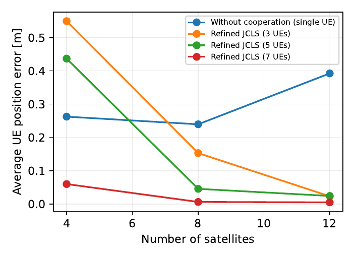
- Preview metadata: [previews/70d12eae5f46__outputs__migration_ladder__step_c3_cov_diag_prior__medium__pos_vary_ues.json](previews/70d12eae5f46__outputs__migration_ladder__step_c3_cov_diag_prior__medium__pos_vary_ues.json)
- Raw data:
  - [outputs/migration_ladder/step_c3_cov_diag_prior/medium/migration_arrays.npz](../migration_ladder/step_c3_cov_diag_prior/medium/migration_arrays.npz)
  - [outputs/migration_ladder/step_c3_cov_diag_prior/medium/migration_raw.csv](../migration_ladder/step_c3_cov_diag_prior/medium/migration_raw.csv)
  - [outputs/migration_ladder/step_c3_cov_diag_prior/medium/migration_summary.csv](../migration_ladder/step_c3_cov_diag_prior/medium/migration_summary.csv)
- Nearby metadata:
  - [outputs/migration_ladder/step_c3_cov_diag_prior/medium/migration_step_metadata.json](../migration_ladder/step_c3_cov_diag_prior/medium/migration_step_metadata.json)

### sync_vary_ues.pdf

- Status: `legacy_network_size_medium_replayed_unverified_match`
- Manuscript ready: `False`
- Source PDF: [outputs/migration_ladder/step_c3_cov_diag_prior/medium/sync_vary_ues.pdf](../migration_ladder/step_c3_cov_diag_prior/medium/sync_vary_ues.pdf)
- Warning: Legacy-compatible network-size medium replay completed under canonical outputs; match is unverified and legacy caveats remain.

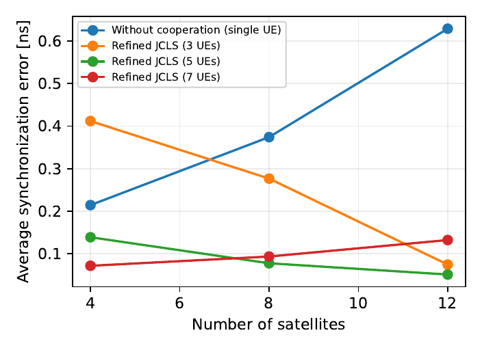
- Preview metadata: [previews/a7169c69f94a__outputs__migration_ladder__step_c3_cov_diag_prior__medium__sync_vary_ues.json](previews/a7169c69f94a__outputs__migration_ladder__step_c3_cov_diag_prior__medium__sync_vary_ues.json)
- Raw data:
  - [outputs/migration_ladder/step_c3_cov_diag_prior/medium/migration_arrays.npz](../migration_ladder/step_c3_cov_diag_prior/medium/migration_arrays.npz)
  - [outputs/migration_ladder/step_c3_cov_diag_prior/medium/migration_raw.csv](../migration_ladder/step_c3_cov_diag_prior/medium/migration_raw.csv)
  - [outputs/migration_ladder/step_c3_cov_diag_prior/medium/migration_summary.csv](../migration_ladder/step_c3_cov_diag_prior/medium/migration_summary.csv)
- Nearby metadata:
  - [outputs/migration_ladder/step_c3_cov_diag_prior/medium/migration_step_metadata.json](../migration_ladder/step_c3_cov_diag_prior/medium/migration_step_metadata.json)

### pos_vary_ues.pdf

- Status: `legacy_network_size_medium_replayed_unverified_match`
- Manuscript ready: `False`
- Source PDF: [outputs/migration_ladder/step_c3_cov_diag_prior/tiny/pos_vary_ues.pdf](../migration_ladder/step_c3_cov_diag_prior/tiny/pos_vary_ues.pdf)
- Warning: Legacy-compatible network-size medium replay completed under canonical outputs; match is unverified and legacy caveats remain.

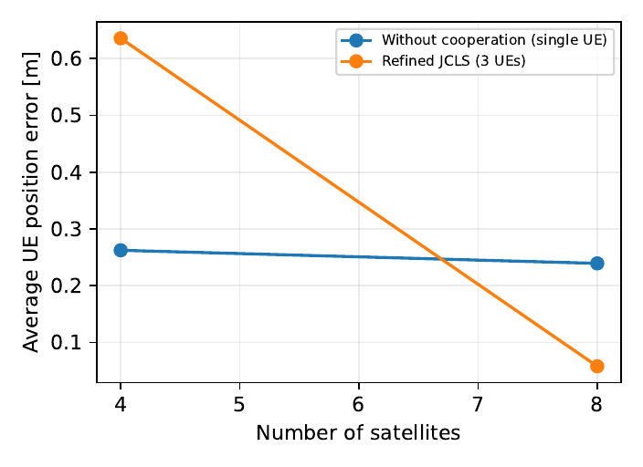
- Preview metadata: [previews/60c33514b9ef__outputs__migration_ladder__step_c3_cov_diag_prior__tiny__pos_vary_ues.json](previews/60c33514b9ef__outputs__migration_ladder__step_c3_cov_diag_prior__tiny__pos_vary_ues.json)
- Raw data:
  - [outputs/migration_ladder/step_c3_cov_diag_prior/tiny/migration_arrays.npz](../migration_ladder/step_c3_cov_diag_prior/tiny/migration_arrays.npz)
  - [outputs/migration_ladder/step_c3_cov_diag_prior/tiny/migration_raw.csv](../migration_ladder/step_c3_cov_diag_prior/tiny/migration_raw.csv)
  - [outputs/migration_ladder/step_c3_cov_diag_prior/tiny/migration_summary.csv](../migration_ladder/step_c3_cov_diag_prior/tiny/migration_summary.csv)
- Nearby metadata:
  - [outputs/migration_ladder/step_c3_cov_diag_prior/tiny/migration_step_metadata.json](../migration_ladder/step_c3_cov_diag_prior/tiny/migration_step_metadata.json)

### sync_vary_ues.pdf

- Status: `legacy_network_size_medium_replayed_unverified_match`
- Manuscript ready: `False`
- Source PDF: [outputs/migration_ladder/step_c3_cov_diag_prior/tiny/sync_vary_ues.pdf](../migration_ladder/step_c3_cov_diag_prior/tiny/sync_vary_ues.pdf)
- Warning: Legacy-compatible network-size medium replay completed under canonical outputs; match is unverified and legacy caveats remain.

- Preview metadata: [previews/7f4a0d1f4a28__outputs__migration_ladder__step_c3_cov_diag_prior__tiny__sync_vary_ues.json](previews/7f4a0d1f4a28__outputs__migration_ladder__step_c3_cov_diag_prior__tiny__sync_vary_ues.json)
- Raw data:
  - [outputs/migration_ladder/step_c3_cov_diag_prior/tiny/migration_arrays.npz](../migration_ladder/step_c3_cov_diag_prior/tiny/migration_arrays.npz)
  - [outputs/migration_ladder/step_c3_cov_diag_prior/tiny/migration_raw.csv](../migration_ladder/step_c3_cov_diag_prior/tiny/migration_raw.csv)
  - [outputs/migration_ladder/step_c3_cov_diag_prior/tiny/migration_summary.csv](../migration_ladder/step_c3_cov_diag_prior/tiny/migration_summary.csv)
- Nearby metadata:
  - [outputs/migration_ladder/step_c3_cov_diag_prior/tiny/migration_step_metadata.json](../migration_ladder/step_c3_cov_diag_prior/tiny/migration_step_metadata.json)

### pos_vary_ues.pdf

- Status: `legacy_network_size_medium_replayed_unverified_match`
- Manuscript ready: `False`
- Source PDF: [outputs/migration_ladder/step_c3_cov_residual_scaled/medium/pos_vary_ues.pdf](../migration_ladder/step_c3_cov_residual_scaled/medium/pos_vary_ues.pdf)
- Warning: Legacy-compatible network-size medium replay completed under canonical outputs; match is unverified and legacy caveats remain.

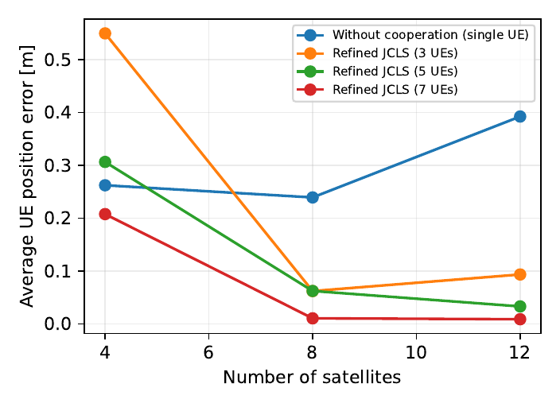
- Preview metadata: [previews/3282438f8381__outputs__migration_ladder__step_c3_cov_residual_scaled__medium__pos_vary_ues.json](previews/3282438f8381__outputs__migration_ladder__step_c3_cov_residual_scaled__medium__pos_vary_ues.json)
- Raw data:
  - [outputs/migration_ladder/step_c3_cov_residual_scaled/medium/migration_arrays.npz](../migration_ladder/step_c3_cov_residual_scaled/medium/migration_arrays.npz)
  - [outputs/migration_ladder/step_c3_cov_residual_scaled/medium/migration_raw.csv](../migration_ladder/step_c3_cov_residual_scaled/medium/migration_raw.csv)
  - [outputs/migration_ladder/step_c3_cov_residual_scaled/medium/migration_summary.csv](../migration_ladder/step_c3_cov_residual_scaled/medium/migration_summary.csv)
- Nearby metadata:
  - [outputs/migration_ladder/step_c3_cov_residual_scaled/medium/migration_step_metadata.json](../migration_ladder/step_c3_cov_residual_scaled/medium/migration_step_metadata.json)

### sync_vary_ues.pdf

- Status: `legacy_network_size_medium_replayed_unverified_match`
- Manuscript ready: `False`
- Source PDF: [outputs/migration_ladder/step_c3_cov_residual_scaled/medium/sync_vary_ues.pdf](../migration_ladder/step_c3_cov_residual_scaled/medium/sync_vary_ues.pdf)
- Warning: Legacy-compatible network-size medium replay completed under canonical outputs; match is unverified and legacy caveats remain.

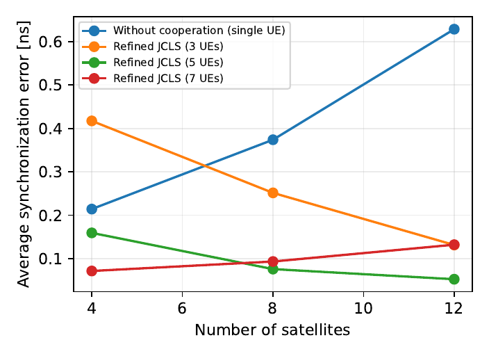
- Preview metadata: [previews/6f56611b5969__outputs__migration_ladder__step_c3_cov_residual_scaled__medium__sync_vary_ues.json](previews/6f56611b5969__outputs__migration_ladder__step_c3_cov_residual_scaled__medium__sync_vary_ues.json)
- Raw data:
  - [outputs/migration_ladder/step_c3_cov_residual_scaled/medium/migration_arrays.npz](../migration_ladder/step_c3_cov_residual_scaled/medium/migration_arrays.npz)
  - [outputs/migration_ladder/step_c3_cov_residual_scaled/medium/migration_raw.csv](../migration_ladder/step_c3_cov_residual_scaled/medium/migration_raw.csv)
  - [outputs/migration_ladder/step_c3_cov_residual_scaled/medium/migration_summary.csv](../migration_ladder/step_c3_cov_residual_scaled/medium/migration_summary.csv)
- Nearby metadata:
  - [outputs/migration_ladder/step_c3_cov_residual_scaled/medium/migration_step_metadata.json](../migration_ladder/step_c3_cov_residual_scaled/medium/migration_step_metadata.json)

### pos_vary_ues.pdf

- Status: `legacy_network_size_medium_replayed_unverified_match`
- Manuscript ready: `False`
- Source PDF: [outputs/migration_ladder/step_c3_cov_residual_scaled/tiny/pos_vary_ues.pdf](../migration_ladder/step_c3_cov_residual_scaled/tiny/pos_vary_ues.pdf)
- Warning: Legacy-compatible network-size medium replay completed under canonical outputs; match is unverified and legacy caveats remain.

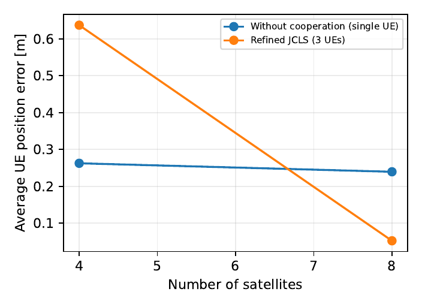
- Preview metadata: [previews/a04096d7f8f3__outputs__migration_ladder__step_c3_cov_residual_scaled__tiny__pos_vary_ues.json](previews/a04096d7f8f3__outputs__migration_ladder__step_c3_cov_residual_scaled__tiny__pos_vary_ues.json)
- Raw data:
  - [outputs/migration_ladder/step_c3_cov_residual_scaled/tiny/migration_arrays.npz](../migration_ladder/step_c3_cov_residual_scaled/tiny/migration_arrays.npz)
  - [outputs/migration_ladder/step_c3_cov_residual_scaled/tiny/migration_raw.csv](../migration_ladder/step_c3_cov_residual_scaled/tiny/migration_raw.csv)
  - [outputs/migration_ladder/step_c3_cov_residual_scaled/tiny/migration_summary.csv](../migration_ladder/step_c3_cov_residual_scaled/tiny/migration_summary.csv)
- Nearby metadata:
  - [outputs/migration_ladder/step_c3_cov_residual_scaled/tiny/migration_step_metadata.json](../migration_ladder/step_c3_cov_residual_scaled/tiny/migration_step_metadata.json)

### sync_vary_ues.pdf

- Status: `legacy_network_size_medium_replayed_unverified_match`
- Manuscript ready: `False`
- Source PDF: [outputs/migration_ladder/step_c3_cov_residual_scaled/tiny/sync_vary_ues.pdf](../migration_ladder/step_c3_cov_residual_scaled/tiny/sync_vary_ues.pdf)
- Warning: Legacy-compatible network-size medium replay completed under canonical outputs; match is unverified and legacy caveats remain.

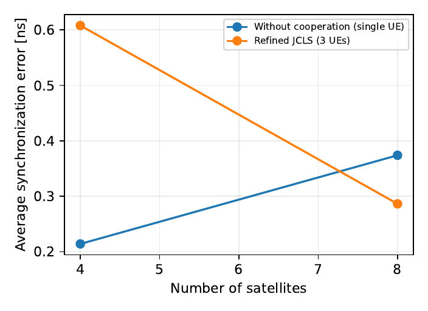
- Preview metadata: [previews/4f4d2a61fd57__outputs__migration_ladder__step_c3_cov_residual_scaled__tiny__sync_vary_ues.json](previews/4f4d2a61fd57__outputs__migration_ladder__step_c3_cov_residual_scaled__tiny__sync_vary_ues.json)
- Raw data:
  - [outputs/migration_ladder/step_c3_cov_residual_scaled/tiny/migration_arrays.npz](../migration_ladder/step_c3_cov_residual_scaled/tiny/migration_arrays.npz)
  - [outputs/migration_ladder/step_c3_cov_residual_scaled/tiny/migration_raw.csv](../migration_ladder/step_c3_cov_residual_scaled/tiny/migration_raw.csv)
  - [outputs/migration_ladder/step_c3_cov_residual_scaled/tiny/migration_summary.csv](../migration_ladder/step_c3_cov_residual_scaled/tiny/migration_summary.csv)
- Nearby metadata:
  - [outputs/migration_ladder/step_c3_cov_residual_scaled/tiny/migration_step_metadata.json](../migration_ladder/step_c3_cov_residual_scaled/tiny/migration_step_metadata.json)

### pos_vary_ues.pdf

- Status: `legacy_network_size_medium_replayed_unverified_match`
- Manuscript ready: `False`
- Source PDF: [outputs/migration_ladder/step_c4_composite_map_acceptance/medium/pos_vary_ues.pdf](../migration_ladder/step_c4_composite_map_acceptance/medium/pos_vary_ues.pdf)
- Warning: Legacy-compatible network-size medium replay completed under canonical outputs; match is unverified and legacy caveats remain.

- Preview metadata: [previews/ce75828f950c__outputs__migration_ladder__step_c4_composite_map_acceptance__medium__pos_vary_ues.json](previews/ce75828f950c__outputs__migration_ladder__step_c4_composite_map_acceptance__medium__pos_vary_ues.json)
- Raw data:
  - [outputs/migration_ladder/step_c4_composite_map_acceptance/medium/migration_arrays.npz](../migration_ladder/step_c4_composite_map_acceptance/medium/migration_arrays.npz)
  - [outputs/migration_ladder/step_c4_composite_map_acceptance/medium/migration_raw.csv](../migration_ladder/step_c4_composite_map_acceptance/medium/migration_raw.csv)
  - [outputs/migration_ladder/step_c4_composite_map_acceptance/medium/migration_summary.csv](../migration_ladder/step_c4_composite_map_acceptance/medium/migration_summary.csv)
- Nearby metadata:
  - [outputs/migration_ladder/step_c4_composite_map_acceptance/medium/migration_step_metadata.json](../migration_ladder/step_c4_composite_map_acceptance/medium/migration_step_metadata.json)

### sync_vary_ues.pdf

- Status: `legacy_network_size_medium_replayed_unverified_match`
- Manuscript ready: `False`
- Source PDF: [outputs/migration_ladder/step_c4_composite_map_acceptance/medium/sync_vary_ues.pdf](../migration_ladder/step_c4_composite_map_acceptance/medium/sync_vary_ues.pdf)
- Warning: Legacy-compatible network-size medium replay completed under canonical outputs; match is unverified and legacy caveats remain.

- Preview metadata: [previews/65a330ffb732__outputs__migration_ladder__step_c4_composite_map_acceptance__medium__sync_vary_ues.json](previews/65a330ffb732__outputs__migration_ladder__step_c4_composite_map_acceptance__medium__sync_vary_ues.json)
- Raw data:
  - [outputs/migration_ladder/step_c4_composite_map_acceptance/medium/migration_arrays.npz](../migration_ladder/step_c4_composite_map_acceptance/medium/migration_arrays.npz)
  - [outputs/migration_ladder/step_c4_composite_map_acceptance/medium/migration_raw.csv](../migration_ladder/step_c4_composite_map_acceptance/medium/migration_raw.csv)
  - [outputs/migration_ladder/step_c4_composite_map_acceptance/medium/migration_summary.csv](../migration_ladder/step_c4_composite_map_acceptance/medium/migration_summary.csv)
- Nearby metadata:
  - [outputs/migration_ladder/step_c4_composite_map_acceptance/medium/migration_step_metadata.json](../migration_ladder/step_c4_composite_map_acceptance/medium/migration_step_metadata.json)

### pos_vary_ues.pdf

- Status: `legacy_network_size_medium_replayed_unverified_match`
- Manuscript ready: `False`
- Source PDF: [outputs/migration_ladder/step_c4_composite_map_acceptance/tiny/pos_vary_ues.pdf](../migration_ladder/step_c4_composite_map_acceptance/tiny/pos_vary_ues.pdf)
- Warning: Legacy-compatible network-size medium replay completed under canonical outputs; match is unverified and legacy caveats remain.

- Preview metadata: [previews/c09fe41a7c79__outputs__migration_ladder__step_c4_composite_map_acceptance__tiny__pos_vary_ues.json](previews/c09fe41a7c79__outputs__migration_ladder__step_c4_composite_map_acceptance__tiny__pos_vary_ues.json)
- Raw data:
  - [outputs/migration_ladder/step_c4_composite_map_acceptance/tiny/migration_arrays.npz](../migration_ladder/step_c4_composite_map_acceptance/tiny/migration_arrays.npz)
  - [outputs/migration_ladder/step_c4_composite_map_acceptance/tiny/migration_raw.csv](../migration_ladder/step_c4_composite_map_acceptance/tiny/migration_raw.csv)
  - [outputs/migration_ladder/step_c4_composite_map_acceptance/tiny/migration_summary.csv](../migration_ladder/step_c4_composite_map_acceptance/tiny/migration_summary.csv)
- Nearby metadata:
  - [outputs/migration_ladder/step_c4_composite_map_acceptance/tiny/migration_step_metadata.json](../migration_ladder/step_c4_composite_map_acceptance/tiny/migration_step_metadata.json)

### sync_vary_ues.pdf

- Status: `legacy_network_size_medium_replayed_unverified_match`
- Manuscript ready: `False`
- Source PDF: [outputs/migration_ladder/step_c4_composite_map_acceptance/tiny/sync_vary_ues.pdf](../migration_ladder/step_c4_composite_map_acceptance/tiny/sync_vary_ues.pdf)
- Warning: Legacy-compatible network-size medium replay completed under canonical outputs; match is unverified and legacy caveats remain.

- Preview metadata: [previews/eacbb2a2b42c__outputs__migration_ladder__step_c4_composite_map_acceptance__tiny__sync_vary_ues.json](previews/eacbb2a2b42c__outputs__migration_ladder__step_c4_composite_map_acceptance__tiny__sync_vary_ues.json)
- Raw data:
  - [outputs/migration_ladder/step_c4_composite_map_acceptance/tiny/migration_arrays.npz](../migration_ladder/step_c4_composite_map_acceptance/tiny/migration_arrays.npz)
  - [outputs/migration_ladder/step_c4_composite_map_acceptance/tiny/migration_raw.csv](../migration_ladder/step_c4_composite_map_acceptance/tiny/migration_raw.csv)
  - [outputs/migration_ladder/step_c4_composite_map_acceptance/tiny/migration_summary.csv](../migration_ladder/step_c4_composite_map_acceptance/tiny/migration_summary.csv)
- Nearby metadata:
  - [outputs/migration_ladder/step_c4_composite_map_acceptance/tiny/migration_step_metadata.json](../migration_ladder/step_c4_composite_map_acceptance/tiny/migration_step_metadata.json)

### pos_vary_ues.pdf

- Status: `legacy_network_size_medium_replayed_unverified_match`
- Manuscript ready: `False`
- Source PDF: [outputs/migration_ladder/step_c5_sliding_window_map/medium/pos_vary_ues.pdf](../migration_ladder/step_c5_sliding_window_map/medium/pos_vary_ues.pdf)
- Warning: Legacy-compatible network-size medium replay completed under canonical outputs; match is unverified and legacy caveats remain.

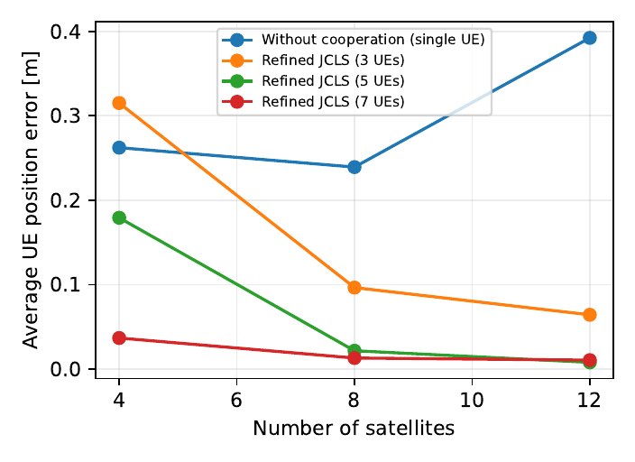
- Preview metadata: [previews/42608899d0c7__outputs__migration_ladder__step_c5_sliding_window_map__medium__pos_vary_ues.json](previews/42608899d0c7__outputs__migration_ladder__step_c5_sliding_window_map__medium__pos_vary_ues.json)
- Raw data:
  - [outputs/migration_ladder/step_c5_sliding_window_map/medium/migration_arrays.npz](../migration_ladder/step_c5_sliding_window_map/medium/migration_arrays.npz)
  - [outputs/migration_ladder/step_c5_sliding_window_map/medium/migration_raw.csv](../migration_ladder/step_c5_sliding_window_map/medium/migration_raw.csv)
  - [outputs/migration_ladder/step_c5_sliding_window_map/medium/migration_summary.csv](../migration_ladder/step_c5_sliding_window_map/medium/migration_summary.csv)
- Nearby metadata:
  - [outputs/migration_ladder/step_c5_sliding_window_map/medium/migration_step_metadata.json](../migration_ladder/step_c5_sliding_window_map/medium/migration_step_metadata.json)

### sync_vary_ues.pdf

- Status: `legacy_network_size_medium_replayed_unverified_match`
- Manuscript ready: `False`
- Source PDF: [outputs/migration_ladder/step_c5_sliding_window_map/medium/sync_vary_ues.pdf](../migration_ladder/step_c5_sliding_window_map/medium/sync_vary_ues.pdf)
- Warning: Legacy-compatible network-size medium replay completed under canonical outputs; match is unverified and legacy caveats remain.

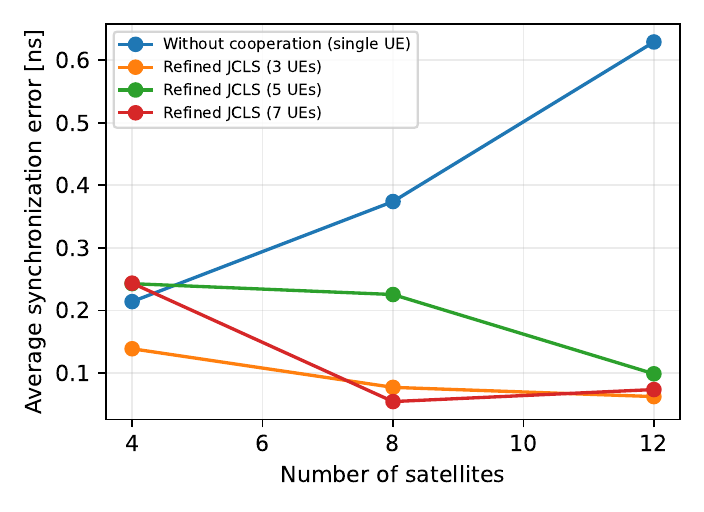
- Preview metadata: [previews/784b5ef2a88c__outputs__migration_ladder__step_c5_sliding_window_map__medium__sync_vary_ues.json](previews/784b5ef2a88c__outputs__migration_ladder__step_c5_sliding_window_map__medium__sync_vary_ues.json)
- Raw data:
  - [outputs/migration_ladder/step_c5_sliding_window_map/medium/migration_arrays.npz](../migration_ladder/step_c5_sliding_window_map/medium/migration_arrays.npz)
  - [outputs/migration_ladder/step_c5_sliding_window_map/medium/migration_raw.csv](../migration_ladder/step_c5_sliding_window_map/medium/migration_raw.csv)
  - [outputs/migration_ladder/step_c5_sliding_window_map/medium/migration_summary.csv](../migration_ladder/step_c5_sliding_window_map/medium/migration_summary.csv)
- Nearby metadata:
  - [outputs/migration_ladder/step_c5_sliding_window_map/medium/migration_step_metadata.json](../migration_ladder/step_c5_sliding_window_map/medium/migration_step_metadata.json)

### pos_vary_ues.pdf

- Status: `legacy_network_size_medium_replayed_unverified_match`
- Manuscript ready: `False`
- Source PDF: [outputs/migration_ladder/step_c5_sliding_window_map/tiny/pos_vary_ues.pdf](../migration_ladder/step_c5_sliding_window_map/tiny/pos_vary_ues.pdf)
- Warning: Legacy-compatible network-size medium replay completed under canonical outputs; match is unverified and legacy caveats remain.

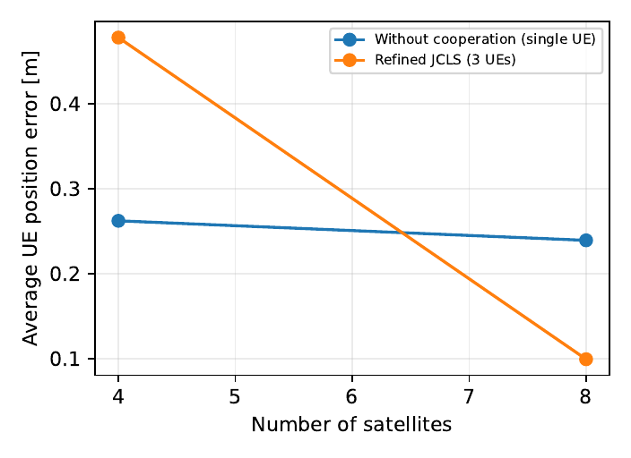
- Preview metadata: [previews/ddea344cc71a__outputs__migration_ladder__step_c5_sliding_window_map__tiny__pos_vary_ues.json](previews/ddea344cc71a__outputs__migration_ladder__step_c5_sliding_window_map__tiny__pos_vary_ues.json)
- Raw data:
  - [outputs/migration_ladder/step_c5_sliding_window_map/tiny/migration_arrays.npz](../migration_ladder/step_c5_sliding_window_map/tiny/migration_arrays.npz)
  - [outputs/migration_ladder/step_c5_sliding_window_map/tiny/migration_raw.csv](../migration_ladder/step_c5_sliding_window_map/tiny/migration_raw.csv)
  - [outputs/migration_ladder/step_c5_sliding_window_map/tiny/migration_summary.csv](../migration_ladder/step_c5_sliding_window_map/tiny/migration_summary.csv)
- Nearby metadata:
  - [outputs/migration_ladder/step_c5_sliding_window_map/tiny/migration_step_metadata.json](../migration_ladder/step_c5_sliding_window_map/tiny/migration_step_metadata.json)

### sync_vary_ues.pdf

- Status: `legacy_network_size_medium_replayed_unverified_match`
- Manuscript ready: `False`
- Source PDF: [outputs/migration_ladder/step_c5_sliding_window_map/tiny/sync_vary_ues.pdf](../migration_ladder/step_c5_sliding_window_map/tiny/sync_vary_ues.pdf)
- Warning: Legacy-compatible network-size medium replay completed under canonical outputs; match is unverified and legacy caveats remain.

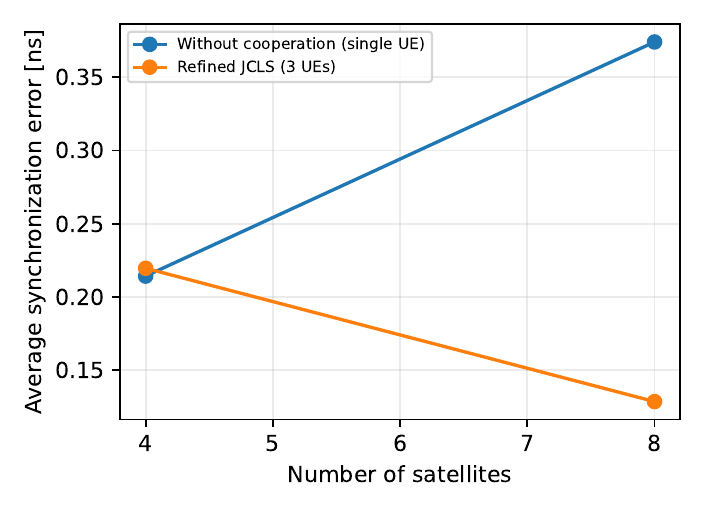
- Preview metadata: [previews/7955e9c8ce28__outputs__migration_ladder__step_c5_sliding_window_map__tiny__sync_vary_ues.json](previews/7955e9c8ce28__outputs__migration_ladder__step_c5_sliding_window_map__tiny__sync_vary_ues.json)
- Raw data:
  - [outputs/migration_ladder/step_c5_sliding_window_map/tiny/migration_arrays.npz](../migration_ladder/step_c5_sliding_window_map/tiny/migration_arrays.npz)
  - [outputs/migration_ladder/step_c5_sliding_window_map/tiny/migration_raw.csv](../migration_ladder/step_c5_sliding_window_map/tiny/migration_raw.csv)
  - [outputs/migration_ladder/step_c5_sliding_window_map/tiny/migration_summary.csv](../migration_ladder/step_c5_sliding_window_map/tiny/migration_summary.csv)
- Nearby metadata:
  - [outputs/migration_ladder/step_c5_sliding_window_map/tiny/migration_step_metadata.json](../migration_ladder/step_c5_sliding_window_map/tiny/migration_step_metadata.json)

## human-review

### fig4_localization_vs_satellites_human_review.pdf

- Status: `diagnostic_output`
- Manuscript ready: `False`
- Source PDF: [v24_human_review_outputs/fig4_localization_vs_satellites_human_review/fig4_localization_vs_satellites_human_review.pdf](../../v24_human_review_outputs/fig4_localization_vs_satellites_human_review/fig4_localization_vs_satellites_human_review.pdf)
- Warning: Diagnostic-only output; not marked manuscript-ready.

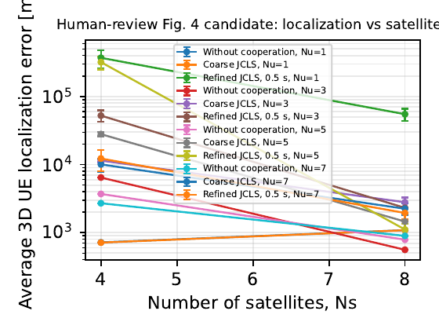
- Preview metadata: [previews/224479d29ab1__fig4_localization_vs_satellites_human_review__fig4_localization_vs_satellites_human_review.json](previews/224479d29ab1__fig4_localization_vs_satellites_human_review__fig4_localization_vs_satellites_human_review.json)
- Raw data:
  - [v24_human_review_outputs/fig4_localization_vs_satellites_human_review/fig4_localization_vs_satellites_human_review_raw.csv](../../v24_human_review_outputs/fig4_localization_vs_satellites_human_review/fig4_localization_vs_satellites_human_review_raw.csv)
  - [v24_human_review_outputs/fig4_localization_vs_satellites_human_review/fig4_localization_vs_satellites_human_review_raw.npz](../../v24_human_review_outputs/fig4_localization_vs_satellites_human_review/fig4_localization_vs_satellites_human_review_raw.npz)
  - [v24_human_review_outputs/fig4_localization_vs_satellites_human_review/fig4_localization_vs_satellites_human_review_summary.csv](../../v24_human_review_outputs/fig4_localization_vs_satellites_human_review/fig4_localization_vs_satellites_human_review_summary.csv)
- Nearby metadata:
  - [v24_human_review_outputs/fig4_localization_vs_satellites_human_review/fig4_localization_vs_satellites_human_review_metadata.json](../../v24_human_review_outputs/fig4_localization_vs_satellites_human_review/fig4_localization_vs_satellites_human_review_metadata.json)

### fig5_synchronization_vs_satellites_human_review.pdf

- Status: `diagnostic_output`
- Manuscript ready: `False`
- Source PDF: [v24_human_review_outputs/fig5_synchronization_vs_satellites_human_review/fig5_synchronization_vs_satellites_human_review.pdf](../../v24_human_review_outputs/fig5_synchronization_vs_satellites_human_review/fig5_synchronization_vs_satellites_human_review.pdf)
- Warning: Diagnostic-only output; not marked manuscript-ready.

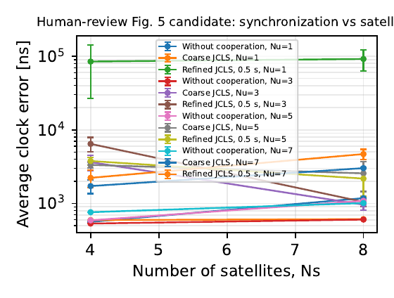
- Preview metadata: [previews/a425ac21260c__ynchronization_vs_satellites_human_review__fig5_synchronization_vs_satellites_human_review.json](previews/a425ac21260c__ynchronization_vs_satellites_human_review__fig5_synchronization_vs_satellites_human_review.json)
- Raw data:
  - [v24_human_review_outputs/fig5_synchronization_vs_satellites_human_review/fig5_synchronization_vs_satellites_human_review_raw.csv](../../v24_human_review_outputs/fig5_synchronization_vs_satellites_human_review/fig5_synchronization_vs_satellites_human_review_raw.csv)
  - [v24_human_review_outputs/fig5_synchronization_vs_satellites_human_review/fig5_synchronization_vs_satellites_human_review_raw.npz](../../v24_human_review_outputs/fig5_synchronization_vs_satellites_human_review/fig5_synchronization_vs_satellites_human_review_raw.npz)
  - [v24_human_review_outputs/fig5_synchronization_vs_satellites_human_review/fig5_synchronization_vs_satellites_human_review_summary.csv](../../v24_human_review_outputs/fig5_synchronization_vs_satellites_human_review/fig5_synchronization_vs_satellites_human_review_summary.csv)
- Nearby metadata:
  - [v24_human_review_outputs/fig5_synchronization_vs_satellites_human_review/fig5_synchronization_vs_satellites_human_review_metadata.json](../../v24_human_review_outputs/fig5_synchronization_vs_satellites_human_review/fig5_synchronization_vs_satellites_human_review_metadata.json)

### fig6_localization_vs_clock_std_human_review.pdf

- Status: `diagnostic_output`
- Manuscript ready: `False`
- Source PDF: [v24_human_review_outputs/fig6_localization_vs_clock_std_human_review/fig6_localization_vs_clock_std_human_review.pdf](../../v24_human_review_outputs/fig6_localization_vs_clock_std_human_review/fig6_localization_vs_clock_std_human_review.pdf)
- Warning: Diagnostic-only output; not marked manuscript-ready.

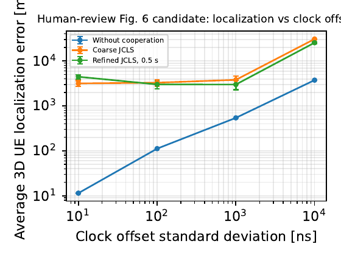
- Preview metadata: [previews/af547fc3eef8____fig6_localization_vs_clock_std_human_review__fig6_localization_vs_clock_std_human_review.json](previews/af547fc3eef8____fig6_localization_vs_clock_std_human_review__fig6_localization_vs_clock_std_human_review.json)
- Raw data:
  - [v24_human_review_outputs/fig6_localization_vs_clock_std_human_review/fig6_localization_vs_clock_std_human_review_raw.csv](../../v24_human_review_outputs/fig6_localization_vs_clock_std_human_review/fig6_localization_vs_clock_std_human_review_raw.csv)
  - [v24_human_review_outputs/fig6_localization_vs_clock_std_human_review/fig6_localization_vs_clock_std_human_review_raw.npz](../../v24_human_review_outputs/fig6_localization_vs_clock_std_human_review/fig6_localization_vs_clock_std_human_review_raw.npz)
  - [v24_human_review_outputs/fig6_localization_vs_clock_std_human_review/fig6_localization_vs_clock_std_human_review_summary.csv](../../v24_human_review_outputs/fig6_localization_vs_clock_std_human_review/fig6_localization_vs_clock_std_human_review_summary.csv)
- Nearby metadata:
  - [v24_human_review_outputs/fig6_localization_vs_clock_std_human_review/fig6_localization_vs_clock_std_human_review_metadata.json](../../v24_human_review_outputs/fig6_localization_vs_clock_std_human_review/fig6_localization_vs_clock_std_human_review_metadata.json)

### fig7_synchronization_vs_clock_std_human_review.pdf

- Status: `diagnostic_output`
- Manuscript ready: `False`
- Source PDF: [v24_human_review_outputs/fig7_synchronization_vs_clock_std_human_review/fig7_synchronization_vs_clock_std_human_review.pdf](../../v24_human_review_outputs/fig7_synchronization_vs_clock_std_human_review/fig7_synchronization_vs_clock_std_human_review.pdf)
- Warning: Diagnostic-only output; not marked manuscript-ready.

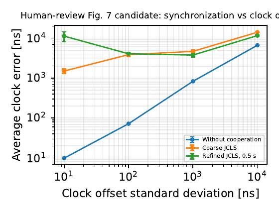
- Preview metadata: [previews/52c79bcf5a34___synchronization_vs_clock_std_human_review__fig7_synchronization_vs_clock_std_human_review.json](previews/52c79bcf5a34___synchronization_vs_clock_std_human_review__fig7_synchronization_vs_clock_std_human_review.json)
- Raw data:
  - [v24_human_review_outputs/fig7_synchronization_vs_clock_std_human_review/fig7_synchronization_vs_clock_std_human_review_raw.csv](../../v24_human_review_outputs/fig7_synchronization_vs_clock_std_human_review/fig7_synchronization_vs_clock_std_human_review_raw.csv)
  - [v24_human_review_outputs/fig7_synchronization_vs_clock_std_human_review/fig7_synchronization_vs_clock_std_human_review_raw.npz](../../v24_human_review_outputs/fig7_synchronization_vs_clock_std_human_review/fig7_synchronization_vs_clock_std_human_review_raw.npz)
  - [v24_human_review_outputs/fig7_synchronization_vs_clock_std_human_review/fig7_synchronization_vs_clock_std_human_review_summary.csv](../../v24_human_review_outputs/fig7_synchronization_vs_clock_std_human_review/fig7_synchronization_vs_clock_std_human_review_summary.csv)
- Nearby metadata:
  - [v24_human_review_outputs/fig7_synchronization_vs_clock_std_human_review/fig7_synchronization_vs_clock_std_human_review_metadata.json](../../v24_human_review_outputs/fig7_synchronization_vs_clock_std_human_review/fig7_synchronization_vs_clock_std_human_review_metadata.json)

## legacy CRLB replay

### pos_crlb_0dB_0dB.pdf

- Status: `legacy_replayed_unverified_match`
- Manuscript ready: `False`
- Source PDF: [outputs/legacy_replay/crlb_los/pos_crlb_0dB_0dB.pdf](../legacy_replay/crlb_los/pos_crlb_0dB_0dB.pdf)
- Warning: Legacy notebook CRLB logic replayed safely into diagnostics, but match to existing artifact is unverified and V24 caveats remain.

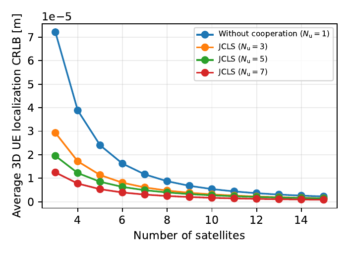
- Preview metadata: [previews/48c2011e003c__outputs__legacy_replay__crlb_los__pos_crlb_0dB_0dB.json](previews/48c2011e003c__outputs__legacy_replay__crlb_los__pos_crlb_0dB_0dB.json)
- Raw data:
  - [outputs/legacy_replay/crlb_los/legacy_crlb_los_arrays.npz](../legacy_replay/crlb_los/legacy_crlb_los_arrays.npz)
  - [outputs/legacy_replay/crlb_los/legacy_pos_plot_y_m.csv](../legacy_replay/crlb_los/legacy_pos_plot_y_m.csv)
  - [outputs/legacy_replay/crlb_los/legacy_sync_plot_y_ns.csv](../legacy_replay/crlb_los/legacy_sync_plot_y_ns.csv)
- Nearby metadata:
  - [outputs/legacy_replay/crlb_los/crlb_los_metadata.json](../legacy_replay/crlb_los/crlb_los_metadata.json)

### sync_crlb_0dB_0dB.pdf

- Status: `legacy_replayed_unverified_match`
- Manuscript ready: `False`
- Source PDF: [outputs/legacy_replay/crlb_los/sync_crlb_0dB_0dB.pdf](../legacy_replay/crlb_los/sync_crlb_0dB_0dB.pdf)
- Warning: Legacy notebook CRLB logic replayed safely into diagnostics, but match to existing artifact is unverified and V24 caveats remain.

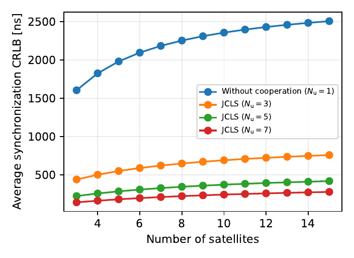
- Preview metadata: [previews/368a9b0bcb73__outputs__legacy_replay__crlb_los__sync_crlb_0dB_0dB.json](previews/368a9b0bcb73__outputs__legacy_replay__crlb_los__sync_crlb_0dB_0dB.json)
- Raw data:
  - [outputs/legacy_replay/crlb_los/legacy_crlb_los_arrays.npz](../legacy_replay/crlb_los/legacy_crlb_los_arrays.npz)
  - [outputs/legacy_replay/crlb_los/legacy_pos_plot_y_m.csv](../legacy_replay/crlb_los/legacy_pos_plot_y_m.csv)
  - [outputs/legacy_replay/crlb_los/legacy_sync_plot_y_ns.csv](../legacy_replay/crlb_los/legacy_sync_plot_y_ns.csv)
- Nearby metadata:
  - [outputs/legacy_replay/crlb_los/crlb_los_metadata.json](../legacy_replay/crlb_los/crlb_los_metadata.json)

### pos_crlb_0dB_0dB.pdf

- Status: `legacy_replayed_unverified_match`
- Manuscript ready: `False`
- Source PDF: [v24_notebook_regression_outputs/executed_legacy/crlb_replay/pos_crlb_0dB_0dB.pdf](../../v24_notebook_regression_outputs/executed_legacy/crlb_replay/pos_crlb_0dB_0dB.pdf)
- Warning: Legacy notebook CRLB logic replayed safely into diagnostics, but match to existing artifact is unverified and V24 caveats remain.

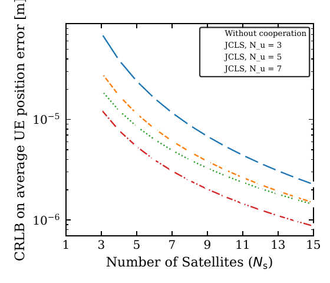
- Preview metadata: [previews/086a67cac4d6__v24_notebook_regression_outputs__executed_legacy__crlb_replay__pos_crlb_0dB_0dB.json](previews/086a67cac4d6__v24_notebook_regression_outputs__executed_legacy__crlb_replay__pos_crlb_0dB_0dB.json)
- Raw data:
  - [v24_notebook_regression_outputs/executed_legacy/crlb_replay/legacy_crlb_replay_arrays.npz](../../v24_notebook_regression_outputs/executed_legacy/crlb_replay/legacy_crlb_replay_arrays.npz)
  - [v24_notebook_regression_outputs/executed_legacy/crlb_replay/legacy_loc_mat_km2_per_user.csv](../../v24_notebook_regression_outputs/executed_legacy/crlb_replay/legacy_loc_mat_km2_per_user.csv)
  - [v24_notebook_regression_outputs/executed_legacy/crlb_replay/legacy_pos_plot_y_m.csv](../../v24_notebook_regression_outputs/executed_legacy/crlb_replay/legacy_pos_plot_y_m.csv)
  - [v24_notebook_regression_outputs/executed_legacy/crlb_replay/legacy_sync_mat_km2_per_clock.csv](../../v24_notebook_regression_outputs/executed_legacy/crlb_replay/legacy_sync_mat_km2_per_clock.csv)
  - [v24_notebook_regression_outputs/executed_legacy/crlb_replay/legacy_sync_plot_y_ns.csv](../../v24_notebook_regression_outputs/executed_legacy/crlb_replay/legacy_sync_plot_y_ns.csv)
- Nearby metadata:
  - [v24_notebook_regression_outputs/executed_legacy/crlb_replay/legacy_crlb_replay_metadata.json](../../v24_notebook_regression_outputs/executed_legacy/crlb_replay/legacy_crlb_replay_metadata.json)

### sync_crlb_0dB_0dB.pdf

- Status: `legacy_replayed_unverified_match`
- Manuscript ready: `False`
- Source PDF: [v24_notebook_regression_outputs/executed_legacy/crlb_replay/sync_crlb_0dB_0dB.pdf](../../v24_notebook_regression_outputs/executed_legacy/crlb_replay/sync_crlb_0dB_0dB.pdf)
- Warning: Legacy notebook CRLB logic replayed safely into diagnostics, but match to existing artifact is unverified and V24 caveats remain.

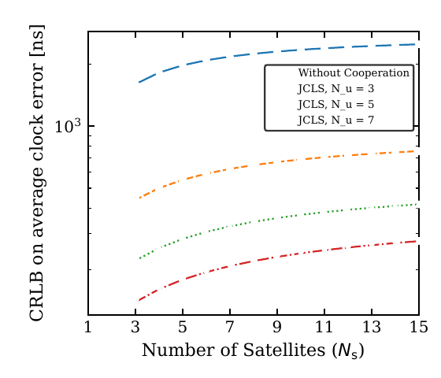
- Preview metadata: [previews/5f69840a390b__v24_notebook_regression_outputs__executed_legacy__crlb_replay__sync_crlb_0dB_0dB.json](previews/5f69840a390b__v24_notebook_regression_outputs__executed_legacy__crlb_replay__sync_crlb_0dB_0dB.json)
- Raw data:
  - [v24_notebook_regression_outputs/executed_legacy/crlb_replay/legacy_crlb_replay_arrays.npz](../../v24_notebook_regression_outputs/executed_legacy/crlb_replay/legacy_crlb_replay_arrays.npz)
  - [v24_notebook_regression_outputs/executed_legacy/crlb_replay/legacy_loc_mat_km2_per_user.csv](../../v24_notebook_regression_outputs/executed_legacy/crlb_replay/legacy_loc_mat_km2_per_user.csv)
  - [v24_notebook_regression_outputs/executed_legacy/crlb_replay/legacy_pos_plot_y_m.csv](../../v24_notebook_regression_outputs/executed_legacy/crlb_replay/legacy_pos_plot_y_m.csv)
  - [v24_notebook_regression_outputs/executed_legacy/crlb_replay/legacy_sync_mat_km2_per_clock.csv](../../v24_notebook_regression_outputs/executed_legacy/crlb_replay/legacy_sync_mat_km2_per_clock.csv)
  - [v24_notebook_regression_outputs/executed_legacy/crlb_replay/legacy_sync_plot_y_ns.csv](../../v24_notebook_regression_outputs/executed_legacy/crlb_replay/legacy_sync_plot_y_ns.csv)
- Nearby metadata:
  - [v24_notebook_regression_outputs/executed_legacy/crlb_replay/legacy_crlb_replay_metadata.json](../../v24_notebook_regression_outputs/executed_legacy/crlb_replay/legacy_crlb_replay_metadata.json)

## legacy clock-sweep full

### pos_vary_clock.pdf

- Status: `legacy_full_replayed_unverified_match`
- Manuscript ready: `False`
- Source PDF: [outputs/legacy_replay/clock_sweep_full/pos_vary_clock.pdf](../legacy_replay/clock_sweep_full/pos_vary_clock.pdf)
- Warning: Full legacy notebook clock-sweep logic replayed in redirected diagnostics; match is unverified and legacy caveats remain.

- Preview metadata: [previews/cb380ae83043__outputs__legacy_replay__clock_sweep_full__pos_vary_clock.json](previews/cb380ae83043__outputs__legacy_replay__clock_sweep_full__pos_vary_clock.json)
- Raw data:
  - [outputs/legacy_replay/clock_sweep_full/legacy_clock_sweep_arrays.npz](../legacy_replay/clock_sweep_full/legacy_clock_sweep_arrays.npz)
  - [outputs/legacy_replay/clock_sweep_full/legacy_clock_sweep_raw.csv](../legacy_replay/clock_sweep_full/legacy_clock_sweep_raw.csv)
  - [outputs/legacy_replay/clock_sweep_full/legacy_clock_sweep_summary.csv](../legacy_replay/clock_sweep_full/legacy_clock_sweep_summary.csv)
- Nearby metadata:
  - [outputs/legacy_replay/clock_sweep_full/legacy_clock_sweep_metadata.json](../legacy_replay/clock_sweep_full/legacy_clock_sweep_metadata.json)

### sync_vary_clock.pdf

- Status: `legacy_full_replayed_unverified_match`
- Manuscript ready: `False`
- Source PDF: [outputs/legacy_replay/clock_sweep_full/sync_vary_clock.pdf](../legacy_replay/clock_sweep_full/sync_vary_clock.pdf)
- Warning: Full legacy notebook clock-sweep logic replayed in redirected diagnostics; match is unverified and legacy caveats remain.

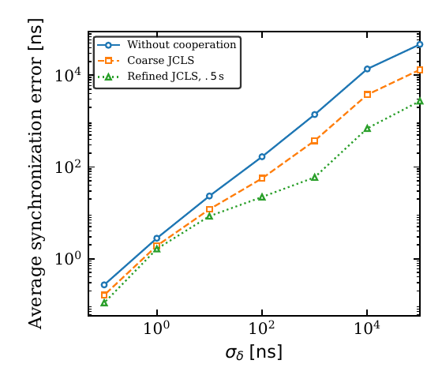
- Preview metadata: [previews/92497dc25e31__outputs__legacy_replay__clock_sweep_full__sync_vary_clock.json](previews/92497dc25e31__outputs__legacy_replay__clock_sweep_full__sync_vary_clock.json)
- Raw data:
  - [outputs/legacy_replay/clock_sweep_full/legacy_clock_sweep_arrays.npz](../legacy_replay/clock_sweep_full/legacy_clock_sweep_arrays.npz)
  - [outputs/legacy_replay/clock_sweep_full/legacy_clock_sweep_raw.csv](../legacy_replay/clock_sweep_full/legacy_clock_sweep_raw.csv)
  - [outputs/legacy_replay/clock_sweep_full/legacy_clock_sweep_summary.csv](../legacy_replay/clock_sweep_full/legacy_clock_sweep_summary.csv)
- Nearby metadata:
  - [outputs/legacy_replay/clock_sweep_full/legacy_clock_sweep_metadata.json](../legacy_replay/clock_sweep_full/legacy_clock_sweep_metadata.json)

### pos_vary_clock.pdf

- Status: `legacy_full_replayed_unverified_match`
- Manuscript ready: `False`
- Source PDF: [v24_notebook_regression_outputs/executed_legacy/clock_sweep_replay_full/pos_vary_clock.pdf](../../v24_notebook_regression_outputs/executed_legacy/clock_sweep_replay_full/pos_vary_clock.pdf)
- Warning: Full legacy notebook clock-sweep logic replayed in redirected diagnostics; match is unverified and legacy caveats remain.

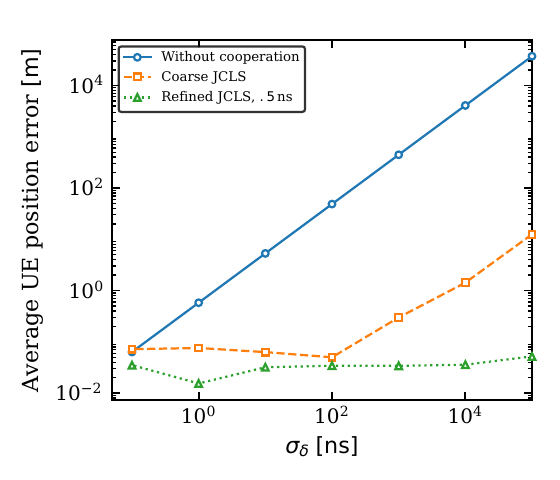
- Preview metadata: [previews/ac4301184086__v24_notebook_regression_outputs__executed_legacy__clock_sweep_replay_full__pos_vary_clock.json](previews/ac4301184086__v24_notebook_regression_outputs__executed_legacy__clock_sweep_replay_full__pos_vary_clock.json)
- Raw data:
  - [v24_notebook_regression_outputs/executed_legacy/clock_sweep_replay_full/legacy_clock_sweep_arrays.npz](../../v24_notebook_regression_outputs/executed_legacy/clock_sweep_replay_full/legacy_clock_sweep_arrays.npz)
  - [v24_notebook_regression_outputs/executed_legacy/clock_sweep_replay_full/legacy_clock_sweep_raw.csv](../../v24_notebook_regression_outputs/executed_legacy/clock_sweep_replay_full/legacy_clock_sweep_raw.csv)
  - [v24_notebook_regression_outputs/executed_legacy/clock_sweep_replay_full/legacy_clock_sweep_summary.csv](../../v24_notebook_regression_outputs/executed_legacy/clock_sweep_replay_full/legacy_clock_sweep_summary.csv)
- Nearby metadata:
  - [v24_notebook_regression_outputs/executed_legacy/clock_sweep_replay_full/legacy_clock_sweep_metadata.json](../../v24_notebook_regression_outputs/executed_legacy/clock_sweep_replay_full/legacy_clock_sweep_metadata.json)

### sync_vary_clock.pdf

- Status: `legacy_full_replayed_unverified_match`
- Manuscript ready: `False`
- Source PDF: [v24_notebook_regression_outputs/executed_legacy/clock_sweep_replay_full/sync_vary_clock.pdf](../../v24_notebook_regression_outputs/executed_legacy/clock_sweep_replay_full/sync_vary_clock.pdf)
- Warning: Full legacy notebook clock-sweep logic replayed in redirected diagnostics; match is unverified and legacy caveats remain.

- Preview metadata: [previews/d265162a62a3__v24_notebook_regression_outputs__executed_legacy__clock_sweep_replay_full__sync_vary_clock.json](previews/d265162a62a3__v24_notebook_regression_outputs__executed_legacy__clock_sweep_replay_full__sync_vary_clock.json)
- Raw data:
  - [v24_notebook_regression_outputs/executed_legacy/clock_sweep_replay_full/legacy_clock_sweep_arrays.npz](../../v24_notebook_regression_outputs/executed_legacy/clock_sweep_replay_full/legacy_clock_sweep_arrays.npz)
  - [v24_notebook_regression_outputs/executed_legacy/clock_sweep_replay_full/legacy_clock_sweep_raw.csv](../../v24_notebook_regression_outputs/executed_legacy/clock_sweep_replay_full/legacy_clock_sweep_raw.csv)
  - [v24_notebook_regression_outputs/executed_legacy/clock_sweep_replay_full/legacy_clock_sweep_summary.csv](../../v24_notebook_regression_outputs/executed_legacy/clock_sweep_replay_full/legacy_clock_sweep_summary.csv)
- Nearby metadata:
  - [v24_notebook_regression_outputs/executed_legacy/clock_sweep_replay_full/legacy_clock_sweep_metadata.json](../../v24_notebook_regression_outputs/executed_legacy/clock_sweep_replay_full/legacy_clock_sweep_metadata.json)

## legacy clock-sweep smoke

### pos_vary_clock.pdf

- Status: `legacy_full_replayed_unverified_match`
- Manuscript ready: `False`
- Source PDF: [v24_notebook_regression_outputs/executed_legacy/clock_sweep_replay/pos_vary_clock.pdf](../../v24_notebook_regression_outputs/executed_legacy/clock_sweep_replay/pos_vary_clock.pdf)
- Warning: Full legacy notebook clock-sweep logic replayed in redirected diagnostics; match is unverified and legacy caveats remain.

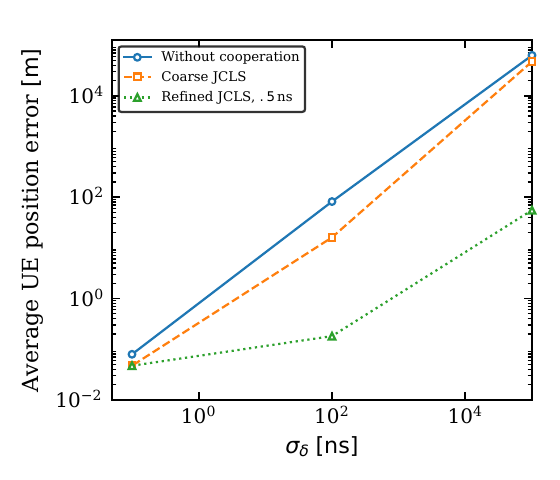
- Preview metadata: [previews/5404b494810f__v24_notebook_regression_outputs__executed_legacy__clock_sweep_replay__pos_vary_clock.json](previews/5404b494810f__v24_notebook_regression_outputs__executed_legacy__clock_sweep_replay__pos_vary_clock.json)
- Raw data:
  - [v24_notebook_regression_outputs/executed_legacy/clock_sweep_replay/legacy_clock_sweep_arrays.npz](../../v24_notebook_regression_outputs/executed_legacy/clock_sweep_replay/legacy_clock_sweep_arrays.npz)
  - [v24_notebook_regression_outputs/executed_legacy/clock_sweep_replay/legacy_clock_sweep_raw.csv](../../v24_notebook_regression_outputs/executed_legacy/clock_sweep_replay/legacy_clock_sweep_raw.csv)
  - [v24_notebook_regression_outputs/executed_legacy/clock_sweep_replay/legacy_clock_sweep_summary.csv](../../v24_notebook_regression_outputs/executed_legacy/clock_sweep_replay/legacy_clock_sweep_summary.csv)
- Nearby metadata:
  - [v24_notebook_regression_outputs/executed_legacy/clock_sweep_replay/legacy_clock_sweep_metadata.json](../../v24_notebook_regression_outputs/executed_legacy/clock_sweep_replay/legacy_clock_sweep_metadata.json)

### sync_vary_clock.pdf

- Status: `legacy_full_replayed_unverified_match`
- Manuscript ready: `False`
- Source PDF: [v24_notebook_regression_outputs/executed_legacy/clock_sweep_replay/sync_vary_clock.pdf](../../v24_notebook_regression_outputs/executed_legacy/clock_sweep_replay/sync_vary_clock.pdf)
- Warning: Full legacy notebook clock-sweep logic replayed in redirected diagnostics; match is unverified and legacy caveats remain.

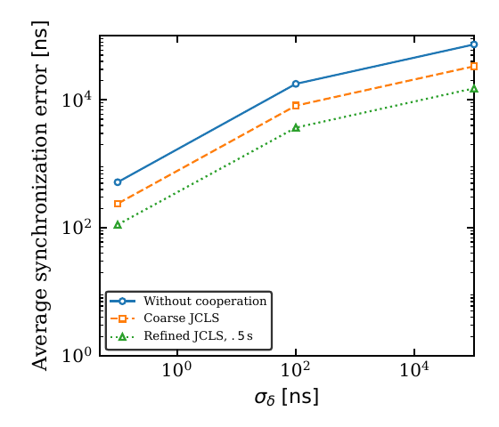
- Preview metadata: [previews/ad8ff758fd8f__v24_notebook_regression_outputs__executed_legacy__clock_sweep_replay__sync_vary_clock.json](previews/ad8ff758fd8f__v24_notebook_regression_outputs__executed_legacy__clock_sweep_replay__sync_vary_clock.json)
- Raw data:
  - [v24_notebook_regression_outputs/executed_legacy/clock_sweep_replay/legacy_clock_sweep_arrays.npz](../../v24_notebook_regression_outputs/executed_legacy/clock_sweep_replay/legacy_clock_sweep_arrays.npz)
  - [v24_notebook_regression_outputs/executed_legacy/clock_sweep_replay/legacy_clock_sweep_raw.csv](../../v24_notebook_regression_outputs/executed_legacy/clock_sweep_replay/legacy_clock_sweep_raw.csv)
  - [v24_notebook_regression_outputs/executed_legacy/clock_sweep_replay/legacy_clock_sweep_summary.csv](../../v24_notebook_regression_outputs/executed_legacy/clock_sweep_replay/legacy_clock_sweep_summary.csv)
- Nearby metadata:
  - [v24_notebook_regression_outputs/executed_legacy/clock_sweep_replay/legacy_clock_sweep_metadata.json](../../v24_notebook_regression_outputs/executed_legacy/clock_sweep_replay/legacy_clock_sweep_metadata.json)

## legacy network-size medium

### pos_vary_ues.pdf

- Status: `legacy_network_size_medium_replayed_unverified_match`
- Manuscript ready: `False`
- Source PDF: [outputs/legacy_replay/network_size_medium/pos_vary_ues.pdf](../legacy_replay/network_size_medium/pos_vary_ues.pdf)
- Warning: Legacy-compatible network-size medium replay completed under canonical outputs; match is unverified and legacy caveats remain.

- Preview metadata: [previews/7def54e11a22__outputs__legacy_replay__network_size_medium__pos_vary_ues.json](previews/7def54e11a22__outputs__legacy_replay__network_size_medium__pos_vary_ues.json)
- Raw data:
  - [outputs/legacy_replay/network_size_medium/legacy_network_size_arrays.npz](../legacy_replay/network_size_medium/legacy_network_size_arrays.npz)
  - [outputs/legacy_replay/network_size_medium/legacy_network_size_raw.csv](../legacy_replay/network_size_medium/legacy_network_size_raw.csv)
  - [outputs/legacy_replay/network_size_medium/legacy_network_size_summary.csv](../legacy_replay/network_size_medium/legacy_network_size_summary.csv)
- Nearby metadata:
  - [outputs/legacy_replay/network_size_medium/legacy_network_size_metadata.json](../legacy_replay/network_size_medium/legacy_network_size_metadata.json)

### sync_vary_ues.pdf

- Status: `legacy_network_size_medium_replayed_unverified_match`
- Manuscript ready: `False`
- Source PDF: [outputs/legacy_replay/network_size_medium/sync_vary_ues.pdf](../legacy_replay/network_size_medium/sync_vary_ues.pdf)
- Warning: Legacy-compatible network-size medium replay completed under canonical outputs; match is unverified and legacy caveats remain.

- Preview metadata: [previews/f52d6c49dc65__outputs__legacy_replay__network_size_medium__sync_vary_ues.json](previews/f52d6c49dc65__outputs__legacy_replay__network_size_medium__sync_vary_ues.json)
- Raw data:
  - [outputs/legacy_replay/network_size_medium/legacy_network_size_arrays.npz](../legacy_replay/network_size_medium/legacy_network_size_arrays.npz)
  - [outputs/legacy_replay/network_size_medium/legacy_network_size_raw.csv](../legacy_replay/network_size_medium/legacy_network_size_raw.csv)
  - [outputs/legacy_replay/network_size_medium/legacy_network_size_summary.csv](../legacy_replay/network_size_medium/legacy_network_size_summary.csv)
- Nearby metadata:
  - [outputs/legacy_replay/network_size_medium/legacy_network_size_metadata.json](../legacy_replay/network_size_medium/legacy_network_size_metadata.json)

## legacy network-size smoke

### pos_vary_ues.pdf

- Status: `legacy_network_size_medium_replayed_unverified_match`
- Manuscript ready: `False`
- Source PDF: [outputs/legacy_replay/network_size/pos_vary_ues.pdf](../legacy_replay/network_size/pos_vary_ues.pdf)
- Warning: Legacy-compatible network-size medium replay completed under canonical outputs; match is unverified and legacy caveats remain.

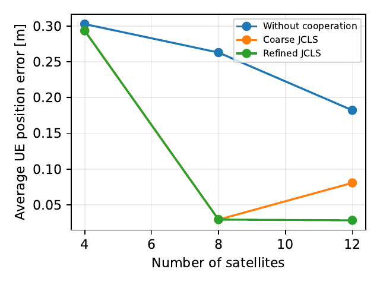
- Preview metadata: [previews/6a76c72975e5__outputs__legacy_replay__network_size__pos_vary_ues.json](previews/6a76c72975e5__outputs__legacy_replay__network_size__pos_vary_ues.json)
- Raw data:
  - [outputs/legacy_replay/network_size/legacy_network_size_arrays.npz](../legacy_replay/network_size/legacy_network_size_arrays.npz)
  - [outputs/legacy_replay/network_size/legacy_network_size_raw.csv](../legacy_replay/network_size/legacy_network_size_raw.csv)
- Nearby metadata:
  - [outputs/legacy_replay/network_size/legacy_network_size_metadata.json](../legacy_replay/network_size/legacy_network_size_metadata.json)

### sync_vary_ues.pdf

- Status: `legacy_network_size_medium_replayed_unverified_match`
- Manuscript ready: `False`
- Source PDF: [outputs/legacy_replay/network_size/sync_vary_ues.pdf](../legacy_replay/network_size/sync_vary_ues.pdf)
- Warning: Legacy-compatible network-size medium replay completed under canonical outputs; match is unverified and legacy caveats remain.

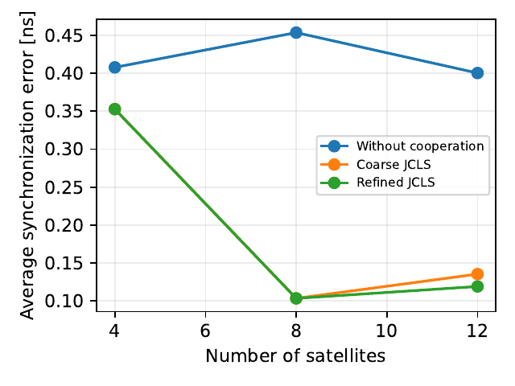
- Preview metadata: [previews/739bb364c402__outputs__legacy_replay__network_size__sync_vary_ues.json](previews/739bb364c402__outputs__legacy_replay__network_size__sync_vary_ues.json)
- Raw data:
  - [outputs/legacy_replay/network_size/legacy_network_size_arrays.npz](../legacy_replay/network_size/legacy_network_size_arrays.npz)
  - [outputs/legacy_replay/network_size/legacy_network_size_raw.csv](../legacy_replay/network_size/legacy_network_size_raw.csv)
- Nearby metadata:
  - [outputs/legacy_replay/network_size/legacy_network_size_metadata.json](../legacy_replay/network_size/legacy_network_size_metadata.json)

## manuscript-candidate

### fig4_localization_vs_satellites_candidate.pdf

- Status: `diagnostic_output`
- Manuscript ready: `False`
- Source PDF: [v24_manuscript_candidate_outputs/fig4_localization_vs_satellites_candidate/fig4_localization_vs_satellites_candidate.pdf](../../v24_manuscript_candidate_outputs/fig4_localization_vs_satellites_candidate/fig4_localization_vs_satellites_candidate.pdf)
- Warning: Diagnostic-only output; not marked manuscript-ready.

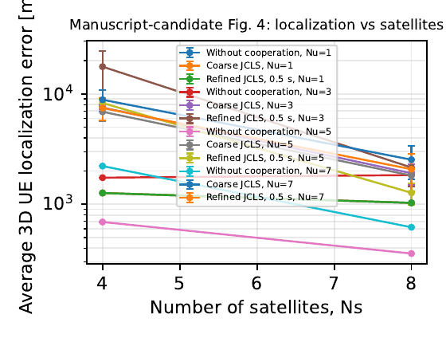
- Preview metadata: [previews/fbef1592a1fc__puts__fig4_localization_vs_satellites_candidate__fig4_localization_vs_satellites_candidate.json](previews/fbef1592a1fc__puts__fig4_localization_vs_satellites_candidate__fig4_localization_vs_satellites_candidate.json)
- Raw data:
  - [v24_manuscript_candidate_outputs/fig4_localization_vs_satellites_candidate/fig4_localization_vs_satellites_candidate_raw.csv](../../v24_manuscript_candidate_outputs/fig4_localization_vs_satellites_candidate/fig4_localization_vs_satellites_candidate_raw.csv)
  - [v24_manuscript_candidate_outputs/fig4_localization_vs_satellites_candidate/fig4_localization_vs_satellites_candidate_raw.npz](../../v24_manuscript_candidate_outputs/fig4_localization_vs_satellites_candidate/fig4_localization_vs_satellites_candidate_raw.npz)
  - [v24_manuscript_candidate_outputs/fig4_localization_vs_satellites_candidate/fig4_localization_vs_satellites_candidate_summary.csv](../../v24_manuscript_candidate_outputs/fig4_localization_vs_satellites_candidate/fig4_localization_vs_satellites_candidate_summary.csv)
- Nearby metadata:
  - [v24_manuscript_candidate_outputs/fig4_localization_vs_satellites_candidate/fig4_localization_vs_satellites_candidate_metadata.json](../../v24_manuscript_candidate_outputs/fig4_localization_vs_satellites_candidate/fig4_localization_vs_satellites_candidate_metadata.json)

### fig5_synchronization_vs_satellites_candidate.pdf

- Status: `diagnostic_output`
- Manuscript ready: `False`
- Source PDF: [v24_manuscript_candidate_outputs/fig5_synchronization_vs_satellites_candidate/fig5_synchronization_vs_satellites_candidate.pdf](../../v24_manuscript_candidate_outputs/fig5_synchronization_vs_satellites_candidate/fig5_synchronization_vs_satellites_candidate.pdf)
- Warning: Diagnostic-only output; not marked manuscript-ready.

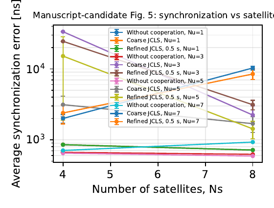
- Preview metadata: [previews/e83b75c3c709__fig5_synchronization_vs_satellites_candidate__fig5_synchronization_vs_satellites_candidate.json](previews/e83b75c3c709__fig5_synchronization_vs_satellites_candidate__fig5_synchronization_vs_satellites_candidate.json)
- Raw data:
  - [v24_manuscript_candidate_outputs/fig5_synchronization_vs_satellites_candidate/fig5_synchronization_vs_satellites_candidate_raw.csv](../../v24_manuscript_candidate_outputs/fig5_synchronization_vs_satellites_candidate/fig5_synchronization_vs_satellites_candidate_raw.csv)
  - [v24_manuscript_candidate_outputs/fig5_synchronization_vs_satellites_candidate/fig5_synchronization_vs_satellites_candidate_raw.npz](../../v24_manuscript_candidate_outputs/fig5_synchronization_vs_satellites_candidate/fig5_synchronization_vs_satellites_candidate_raw.npz)
  - [v24_manuscript_candidate_outputs/fig5_synchronization_vs_satellites_candidate/fig5_synchronization_vs_satellites_candidate_summary.csv](../../v24_manuscript_candidate_outputs/fig5_synchronization_vs_satellites_candidate/fig5_synchronization_vs_satellites_candidate_summary.csv)
- Nearby metadata:
  - [v24_manuscript_candidate_outputs/fig5_synchronization_vs_satellites_candidate/fig5_synchronization_vs_satellites_candidate_metadata.json](../../v24_manuscript_candidate_outputs/fig5_synchronization_vs_satellites_candidate/fig5_synchronization_vs_satellites_candidate_metadata.json)

### fig6_localization_vs_clock_std_candidate.pdf

- Status: `diagnostic_output`
- Manuscript ready: `False`
- Source PDF: [v24_manuscript_candidate_outputs/fig6_localization_vs_clock_std_candidate/fig6_localization_vs_clock_std_candidate.pdf](../../v24_manuscript_candidate_outputs/fig6_localization_vs_clock_std_candidate/fig6_localization_vs_clock_std_candidate.pdf)
- Warning: Diagnostic-only output; not marked manuscript-ready.

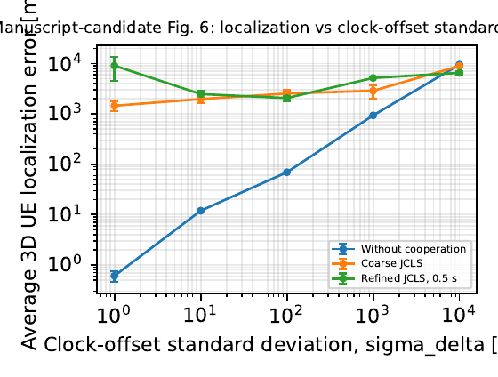
- Preview metadata: [previews/58fc33a4140a__utputs__fig6_localization_vs_clock_std_candidate__fig6_localization_vs_clock_std_candidate.json](previews/58fc33a4140a__utputs__fig6_localization_vs_clock_std_candidate__fig6_localization_vs_clock_std_candidate.json)
- Raw data:
  - [v24_manuscript_candidate_outputs/fig6_localization_vs_clock_std_candidate/fig6_localization_vs_clock_std_candidate_raw.csv](../../v24_manuscript_candidate_outputs/fig6_localization_vs_clock_std_candidate/fig6_localization_vs_clock_std_candidate_raw.csv)
  - [v24_manuscript_candidate_outputs/fig6_localization_vs_clock_std_candidate/fig6_localization_vs_clock_std_candidate_raw.npz](../../v24_manuscript_candidate_outputs/fig6_localization_vs_clock_std_candidate/fig6_localization_vs_clock_std_candidate_raw.npz)
  - [v24_manuscript_candidate_outputs/fig6_localization_vs_clock_std_candidate/fig6_localization_vs_clock_std_candidate_summary.csv](../../v24_manuscript_candidate_outputs/fig6_localization_vs_clock_std_candidate/fig6_localization_vs_clock_std_candidate_summary.csv)
- Nearby metadata:
  - [v24_manuscript_candidate_outputs/fig6_localization_vs_clock_std_candidate/fig6_localization_vs_clock_std_candidate_metadata.json](../../v24_manuscript_candidate_outputs/fig6_localization_vs_clock_std_candidate/fig6_localization_vs_clock_std_candidate_metadata.json)

### fig7_synchronization_vs_clock_std_candidate.pdf

- Status: `diagnostic_output`
- Manuscript ready: `False`
- Source PDF: [v24_manuscript_candidate_outputs/fig7_synchronization_vs_clock_std_candidate/fig7_synchronization_vs_clock_std_candidate.pdf](../../v24_manuscript_candidate_outputs/fig7_synchronization_vs_clock_std_candidate/fig7_synchronization_vs_clock_std_candidate.pdf)
- Warning: Diagnostic-only output; not marked manuscript-ready.

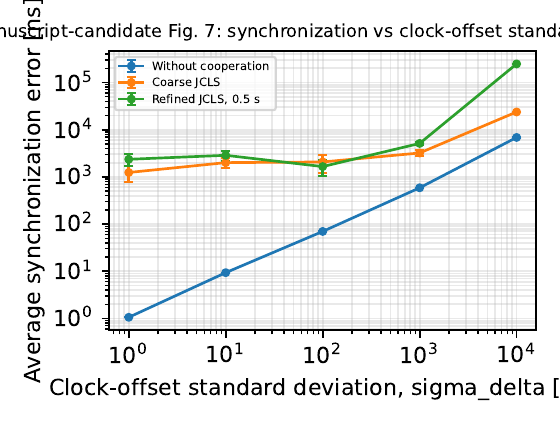
- Preview metadata: [previews/36e4b878d9e3____fig7_synchronization_vs_clock_std_candidate__fig7_synchronization_vs_clock_std_candidate.json](previews/36e4b878d9e3____fig7_synchronization_vs_clock_std_candidate__fig7_synchronization_vs_clock_std_candidate.json)
- Raw data:
  - [v24_manuscript_candidate_outputs/fig7_synchronization_vs_clock_std_candidate/fig7_synchronization_vs_clock_std_candidate_raw.csv](../../v24_manuscript_candidate_outputs/fig7_synchronization_vs_clock_std_candidate/fig7_synchronization_vs_clock_std_candidate_raw.csv)
  - [v24_manuscript_candidate_outputs/fig7_synchronization_vs_clock_std_candidate/fig7_synchronization_vs_clock_std_candidate_raw.npz](../../v24_manuscript_candidate_outputs/fig7_synchronization_vs_clock_std_candidate/fig7_synchronization_vs_clock_std_candidate_raw.npz)
  - [v24_manuscript_candidate_outputs/fig7_synchronization_vs_clock_std_candidate/fig7_synchronization_vs_clock_std_candidate_summary.csv](../../v24_manuscript_candidate_outputs/fig7_synchronization_vs_clock_std_candidate/fig7_synchronization_vs_clock_std_candidate_summary.csv)
- Nearby metadata:
  - [v24_manuscript_candidate_outputs/fig7_synchronization_vs_clock_std_candidate/fig7_synchronization_vs_clock_std_candidate_metadata.json](../../v24_manuscript_candidate_outputs/fig7_synchronization_vs_clock_std_candidate/fig7_synchronization_vs_clock_std_candidate_metadata.json)

## migration baseline

### pos_vary_clock.pdf

- Status: `legacy_full_replayed_unverified_match`
- Manuscript ready: `False`
- Source PDF: [outputs/migration_baseline/legacy_behavior_freeze/clock_sweep_full/pos_vary_clock.pdf](../migration_baseline/legacy_behavior_freeze/clock_sweep_full/pos_vary_clock.pdf)
- Warning: Full legacy notebook clock-sweep logic replayed in redirected diagnostics; match is unverified and legacy caveats remain.

- Preview metadata: [previews/277b63b60501__outputs__migration_baseline__legacy_behavior_freeze__clock_sweep_full__pos_vary_clock.json](previews/277b63b60501__outputs__migration_baseline__legacy_behavior_freeze__clock_sweep_full__pos_vary_clock.json)
- Raw data:
  - [outputs/migration_baseline/legacy_behavior_freeze/clock_sweep_full/legacy_clock_sweep_arrays.npz](../migration_baseline/legacy_behavior_freeze/clock_sweep_full/legacy_clock_sweep_arrays.npz)
  - [outputs/migration_baseline/legacy_behavior_freeze/clock_sweep_full/legacy_clock_sweep_raw.csv](../migration_baseline/legacy_behavior_freeze/clock_sweep_full/legacy_clock_sweep_raw.csv)
  - [outputs/migration_baseline/legacy_behavior_freeze/clock_sweep_full/legacy_clock_sweep_summary.csv](../migration_baseline/legacy_behavior_freeze/clock_sweep_full/legacy_clock_sweep_summary.csv)
- Nearby metadata:
  - [outputs/migration_baseline/legacy_behavior_freeze/clock_sweep_full/legacy_clock_sweep_metadata.json](../migration_baseline/legacy_behavior_freeze/clock_sweep_full/legacy_clock_sweep_metadata.json)

### sync_vary_clock.pdf

- Status: `legacy_full_replayed_unverified_match`
- Manuscript ready: `False`
- Source PDF: [outputs/migration_baseline/legacy_behavior_freeze/clock_sweep_full/sync_vary_clock.pdf](../migration_baseline/legacy_behavior_freeze/clock_sweep_full/sync_vary_clock.pdf)
- Warning: Full legacy notebook clock-sweep logic replayed in redirected diagnostics; match is unverified and legacy caveats remain.

- Preview metadata: [previews/5812b3fb37b1__outputs__migration_baseline__legacy_behavior_freeze__clock_sweep_full__sync_vary_clock.json](previews/5812b3fb37b1__outputs__migration_baseline__legacy_behavior_freeze__clock_sweep_full__sync_vary_clock.json)
- Raw data:
  - [outputs/migration_baseline/legacy_behavior_freeze/clock_sweep_full/legacy_clock_sweep_arrays.npz](../migration_baseline/legacy_behavior_freeze/clock_sweep_full/legacy_clock_sweep_arrays.npz)
  - [outputs/migration_baseline/legacy_behavior_freeze/clock_sweep_full/legacy_clock_sweep_raw.csv](../migration_baseline/legacy_behavior_freeze/clock_sweep_full/legacy_clock_sweep_raw.csv)
  - [outputs/migration_baseline/legacy_behavior_freeze/clock_sweep_full/legacy_clock_sweep_summary.csv](../migration_baseline/legacy_behavior_freeze/clock_sweep_full/legacy_clock_sweep_summary.csv)
- Nearby metadata:
  - [outputs/migration_baseline/legacy_behavior_freeze/clock_sweep_full/legacy_clock_sweep_metadata.json](../migration_baseline/legacy_behavior_freeze/clock_sweep_full/legacy_clock_sweep_metadata.json)

### pos_vary_ues.pdf

- Status: `legacy_network_size_medium_replayed_unverified_match`
- Manuscript ready: `False`
- Source PDF: [outputs/migration_baseline/legacy_behavior_freeze/network_size_medium/pos_vary_ues.pdf](../migration_baseline/legacy_behavior_freeze/network_size_medium/pos_vary_ues.pdf)
- Warning: Legacy-compatible network-size medium replay completed under canonical outputs; match is unverified and legacy caveats remain.

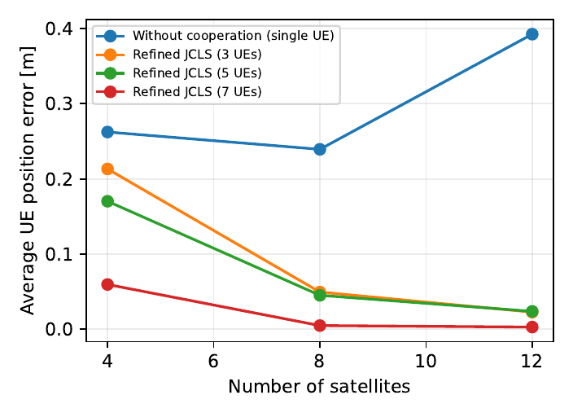
- Preview metadata: [previews/818b910f9e60__outputs__migration_baseline__legacy_behavior_freeze__network_size_medium__pos_vary_ues.json](previews/818b910f9e60__outputs__migration_baseline__legacy_behavior_freeze__network_size_medium__pos_vary_ues.json)
- Raw data:
  - [outputs/migration_baseline/legacy_behavior_freeze/network_size_medium/legacy_network_size_arrays.npz](../migration_baseline/legacy_behavior_freeze/network_size_medium/legacy_network_size_arrays.npz)
  - [outputs/migration_baseline/legacy_behavior_freeze/network_size_medium/legacy_network_size_raw.csv](../migration_baseline/legacy_behavior_freeze/network_size_medium/legacy_network_size_raw.csv)
  - [outputs/migration_baseline/legacy_behavior_freeze/network_size_medium/legacy_network_size_summary.csv](../migration_baseline/legacy_behavior_freeze/network_size_medium/legacy_network_size_summary.csv)
- Nearby metadata:
  - [outputs/migration_baseline/legacy_behavior_freeze/network_size_medium/legacy_network_size_metadata.json](../migration_baseline/legacy_behavior_freeze/network_size_medium/legacy_network_size_metadata.json)

### sync_vary_ues.pdf

- Status: `legacy_network_size_medium_replayed_unverified_match`
- Manuscript ready: `False`
- Source PDF: [outputs/migration_baseline/legacy_behavior_freeze/network_size_medium/sync_vary_ues.pdf](../migration_baseline/legacy_behavior_freeze/network_size_medium/sync_vary_ues.pdf)
- Warning: Legacy-compatible network-size medium replay completed under canonical outputs; match is unverified and legacy caveats remain.

- Preview metadata: [previews/1601e22bd10d__outputs__migration_baseline__legacy_behavior_freeze__network_size_medium__sync_vary_ues.json](previews/1601e22bd10d__outputs__migration_baseline__legacy_behavior_freeze__network_size_medium__sync_vary_ues.json)
- Raw data:
  - [outputs/migration_baseline/legacy_behavior_freeze/network_size_medium/legacy_network_size_arrays.npz](../migration_baseline/legacy_behavior_freeze/network_size_medium/legacy_network_size_arrays.npz)
  - [outputs/migration_baseline/legacy_behavior_freeze/network_size_medium/legacy_network_size_raw.csv](../migration_baseline/legacy_behavior_freeze/network_size_medium/legacy_network_size_raw.csv)
  - [outputs/migration_baseline/legacy_behavior_freeze/network_size_medium/legacy_network_size_summary.csv](../migration_baseline/legacy_behavior_freeze/network_size_medium/legacy_network_size_summary.csv)
- Nearby metadata:
  - [outputs/migration_baseline/legacy_behavior_freeze/network_size_medium/legacy_network_size_metadata.json](../migration_baseline/legacy_behavior_freeze/network_size_medium/legacy_network_size_metadata.json)

## package diagnostic

### fig4_localization_vs_satellites.pdf

- Status: `diagnostic_output`
- Manuscript ready: `False`
- Source PDF: [v24_figure_outputs/fig4_localization_vs_satellites/fig4_localization_vs_satellites.pdf](../../v24_figure_outputs/fig4_localization_vs_satellites/fig4_localization_vs_satellites.pdf)
- Warning: Diagnostic-only output; not marked manuscript-ready.

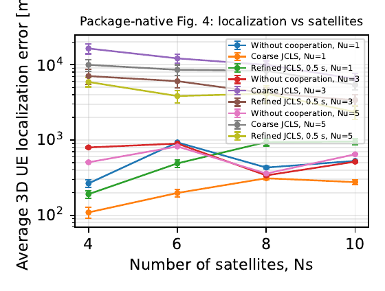
- Preview metadata: [previews/af914d01c822__v24_figure_outputs__fig4_localization_vs_satellites__fig4_localization_vs_satellites.json](previews/af914d01c822__v24_figure_outputs__fig4_localization_vs_satellites__fig4_localization_vs_satellites.json)
- Raw data:
  - [v24_figure_outputs/fig4_localization_vs_satellites/fig4_localization_vs_satellites_raw.csv](../../v24_figure_outputs/fig4_localization_vs_satellites/fig4_localization_vs_satellites_raw.csv)
  - [v24_figure_outputs/fig4_localization_vs_satellites/fig4_localization_vs_satellites_raw.npz](../../v24_figure_outputs/fig4_localization_vs_satellites/fig4_localization_vs_satellites_raw.npz)
  - [v24_figure_outputs/fig4_localization_vs_satellites/fig4_localization_vs_satellites_summary.csv](../../v24_figure_outputs/fig4_localization_vs_satellites/fig4_localization_vs_satellites_summary.csv)
- Nearby metadata:
  - [v24_figure_outputs/fig4_localization_vs_satellites/fig4_localization_vs_satellites_metadata.json](../../v24_figure_outputs/fig4_localization_vs_satellites/fig4_localization_vs_satellites_metadata.json)

### fig5_synchronization_vs_satellites.pdf

- Status: `diagnostic_output`
- Manuscript ready: `False`
- Source PDF: [v24_figure_outputs/fig5_synchronization_vs_satellites/fig5_synchronization_vs_satellites.pdf](../../v24_figure_outputs/fig5_synchronization_vs_satellites/fig5_synchronization_vs_satellites.pdf)
- Warning: Diagnostic-only output; not marked manuscript-ready.

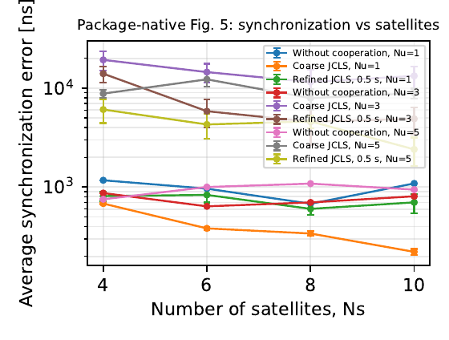
- Preview metadata: [previews/a2a4ac4f9ccd__v24_figure_outputs__fig5_synchronization_vs_satellites__fig5_synchronization_vs_satellites.json](previews/a2a4ac4f9ccd__v24_figure_outputs__fig5_synchronization_vs_satellites__fig5_synchronization_vs_satellites.json)
- Raw data:
  - [v24_figure_outputs/fig5_synchronization_vs_satellites/fig5_synchronization_vs_satellites_raw.csv](../../v24_figure_outputs/fig5_synchronization_vs_satellites/fig5_synchronization_vs_satellites_raw.csv)
  - [v24_figure_outputs/fig5_synchronization_vs_satellites/fig5_synchronization_vs_satellites_raw.npz](../../v24_figure_outputs/fig5_synchronization_vs_satellites/fig5_synchronization_vs_satellites_raw.npz)
  - [v24_figure_outputs/fig5_synchronization_vs_satellites/fig5_synchronization_vs_satellites_summary.csv](../../v24_figure_outputs/fig5_synchronization_vs_satellites/fig5_synchronization_vs_satellites_summary.csv)
- Nearby metadata:
  - [v24_figure_outputs/fig5_synchronization_vs_satellites/fig5_synchronization_vs_satellites_metadata.json](../../v24_figure_outputs/fig5_synchronization_vs_satellites/fig5_synchronization_vs_satellites_metadata.json)

### fig6_localization_vs_clock_std.pdf

- Status: `diagnostic_output`
- Manuscript ready: `False`
- Source PDF: [v24_figure_outputs/fig6_localization_vs_clock_std/fig6_localization_vs_clock_std.pdf](../../v24_figure_outputs/fig6_localization_vs_clock_std/fig6_localization_vs_clock_std.pdf)
- Warning: Diagnostic-only output; not marked manuscript-ready.

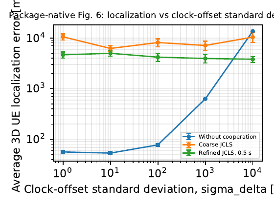
- Preview metadata: [previews/2049835fa675__v24_figure_outputs__fig6_localization_vs_clock_std__fig6_localization_vs_clock_std.json](previews/2049835fa675__v24_figure_outputs__fig6_localization_vs_clock_std__fig6_localization_vs_clock_std.json)
- Raw data:
  - [v24_figure_outputs/fig6_localization_vs_clock_std/fig6_localization_vs_clock_std_raw.csv](../../v24_figure_outputs/fig6_localization_vs_clock_std/fig6_localization_vs_clock_std_raw.csv)
  - [v24_figure_outputs/fig6_localization_vs_clock_std/fig6_localization_vs_clock_std_raw.npz](../../v24_figure_outputs/fig6_localization_vs_clock_std/fig6_localization_vs_clock_std_raw.npz)
  - [v24_figure_outputs/fig6_localization_vs_clock_std/fig6_localization_vs_clock_std_summary.csv](../../v24_figure_outputs/fig6_localization_vs_clock_std/fig6_localization_vs_clock_std_summary.csv)
- Nearby metadata:
  - [v24_figure_outputs/fig6_localization_vs_clock_std/fig6_localization_vs_clock_std_metadata.json](../../v24_figure_outputs/fig6_localization_vs_clock_std/fig6_localization_vs_clock_std_metadata.json)

### fig7_synchronization_vs_clock_std.pdf

- Status: `diagnostic_output`
- Manuscript ready: `False`
- Source PDF: [v24_figure_outputs/fig7_synchronization_vs_clock_std/fig7_synchronization_vs_clock_std.pdf](../../v24_figure_outputs/fig7_synchronization_vs_clock_std/fig7_synchronization_vs_clock_std.pdf)
- Warning: Diagnostic-only output; not marked manuscript-ready.

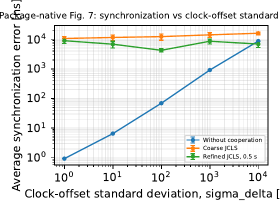
- Preview metadata: [previews/0835b288adef__v24_figure_outputs__fig7_synchronization_vs_clock_std__fig7_synchronization_vs_clock_std.json](previews/0835b288adef__v24_figure_outputs__fig7_synchronization_vs_clock_std__fig7_synchronization_vs_clock_std.json)
- Raw data:
  - [v24_figure_outputs/fig7_synchronization_vs_clock_std/fig7_synchronization_vs_clock_std_raw.csv](../../v24_figure_outputs/fig7_synchronization_vs_clock_std/fig7_synchronization_vs_clock_std_raw.csv)
  - [v24_figure_outputs/fig7_synchronization_vs_clock_std/fig7_synchronization_vs_clock_std_raw.npz](../../v24_figure_outputs/fig7_synchronization_vs_clock_std/fig7_synchronization_vs_clock_std_raw.npz)
  - [v24_figure_outputs/fig7_synchronization_vs_clock_std/fig7_synchronization_vs_clock_std_summary.csv](../../v24_figure_outputs/fig7_synchronization_vs_clock_std/fig7_synchronization_vs_clock_std_summary.csv)
- Nearby metadata:
  - [v24_figure_outputs/fig7_synchronization_vs_clock_std/fig7_synchronization_vs_clock_std_metadata.json](../../v24_figure_outputs/fig7_synchronization_vs_clock_std/fig7_synchronization_vs_clock_std_metadata.json)

